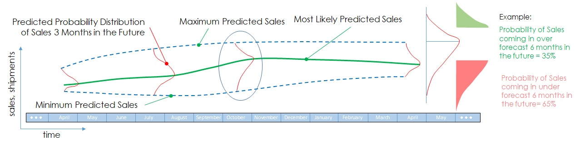
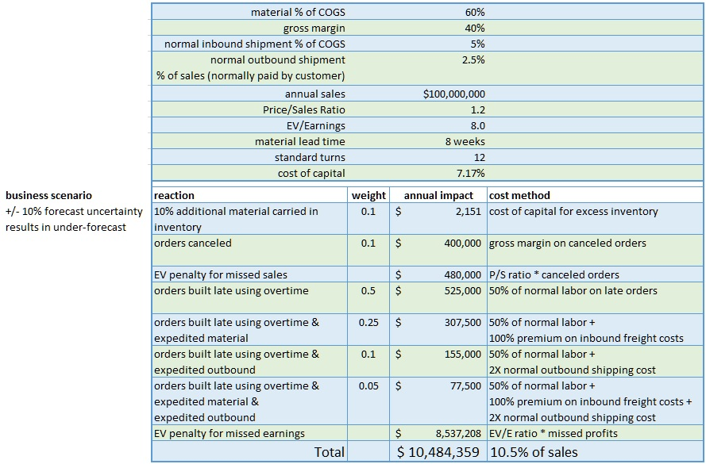
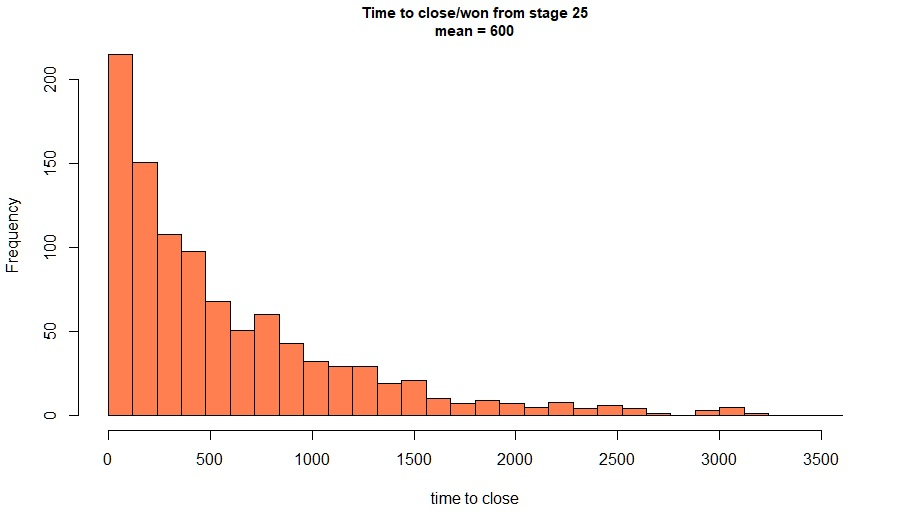
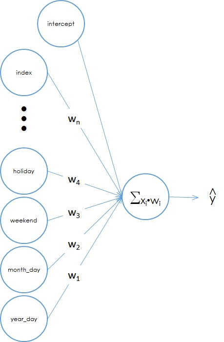
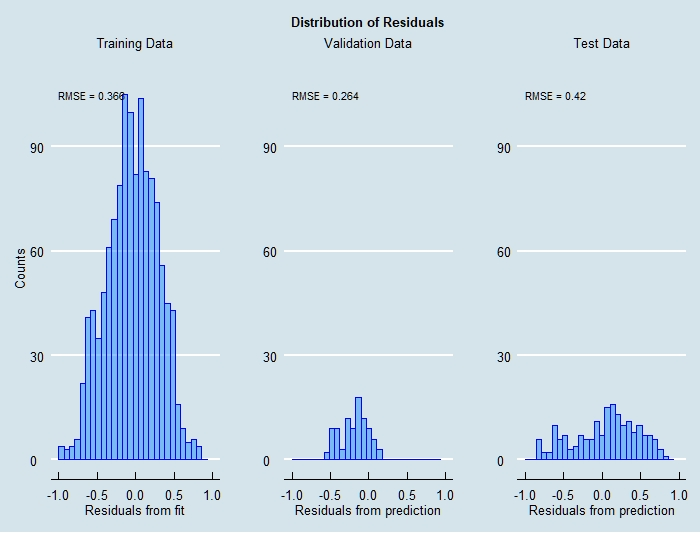
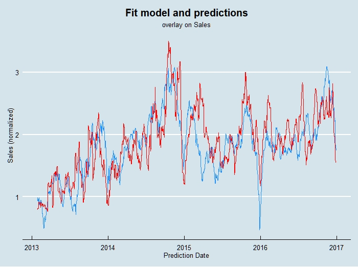
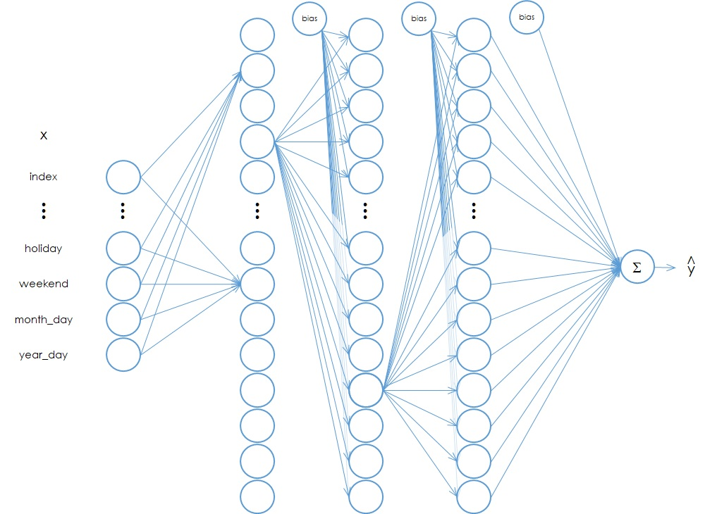
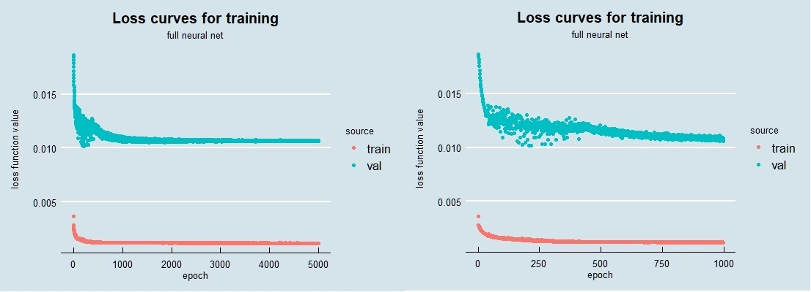
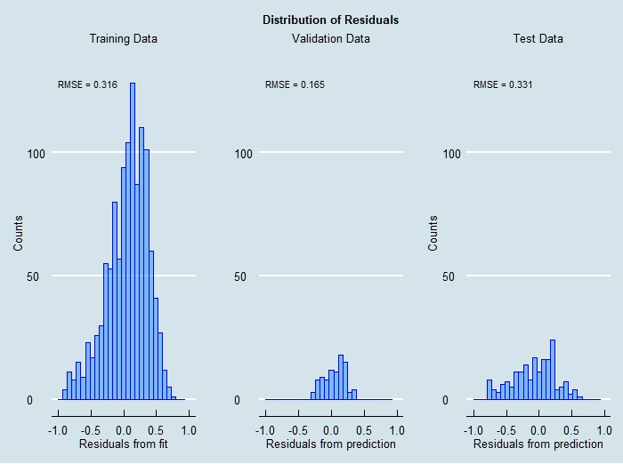
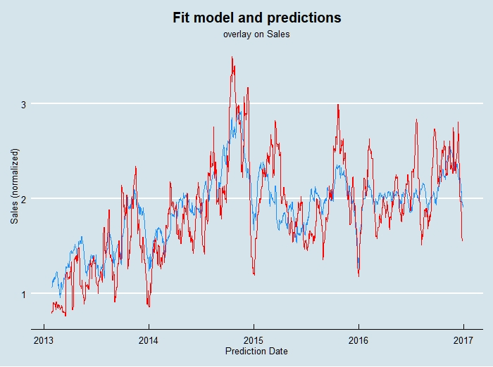

```{r setup, include=FALSE}
knitr::opts_chunk$set(echo = TRUE)
options(warn = 1)
```
```{r function defs, echo=FALSE, message=FALSE, warning=FALSE}
  scale_0_to_1 <- function(data, scale_cols) {
#    
    scales <- as.data.frame(matrix(0, ncol = 2))
#    
    for (i in 1:length(scale_cols)) {
      scales[i, 1] <- 
        max(data[, scale_cols[i]], na.rm = TRUE) -
        min(data[, scale_cols[i]], na.rm = TRUE)
      scales[i, 2] <- 
        min(data[, scale_cols[i]], na.rm = TRUE)
    }
    data[, scale_cols] <- 
      scale(data[, scale_cols], 
            center = scales[, 2], 
            scale = scales[, 1]) %>%
      as.data.frame()
    return(data)
  }
```

```{r libraries, echo=FALSE, message=FALSE, warning=FALSE}
#
# load needed libraries ----
#
# dplyr provides pipes etc.
#
  library(dplyr)
#
  library(tidyverse)
#
# ggthemes gives us ggplot themes
#
  library(ggthemes)
#
# gridExtra allows arraning multiple ggplots
#
  library(gridExtra)
#
# reshape2 provies melt and cast
#
  library(reshape2)
#
# scales formats dollars etc. in plots
#
  library(scales)
#
# keras provides access to TensorFlow NN modeling
#
  library(keras)
#
# caret gives us the trainControl method and resampling
#
  library(caret)
#
# glmnet provides ridge, lasso, and elastic net regression
#
  library(glmnet)
#
```
```{r Buisness Understanding}
```

<style type="text/css">
body{ /* Normal */
      font-size: 16pt;
    }
</style>

<font size=28pt> **1. Introduction**</font>

Forecasting is an historical pain point dating back to at least the time of Mesopotamia[^1] and even being regulated during the Roman empire[^2].  Unfortunately forecasters have been persecuted through the ages; a recent example being the charging of scientists and their managers with manslaughter in Italy for failing to warn of an earthquake (fortunately they were exonerated).[^3]  In their excellent book "Forecasting Principles and Practice", Rob Hyndman and George Athanasopoulos note the perils of being a forecaster, quoting Emperor Constantine's decree in AD357 forbidding "to consult a soothsayer, a mathematician, or a forecaster" (note the historical lumping of math in with fortune telling!).[^4]

<font size=28pt> **2. Problem Statement**</font>

In this article I want to demonstrate some methods of time series forecasting that are less often cited in the myriad data science tutorials etc.; namely the use of regression models, including artificial neural networks, to forecast.  I will describe a business use case adapted from a client engagement, where the goal was to forecast sales up to a year in advance for a specialty electronics manufacturing firm in the B2B segment.  Some aspects have been adjusted or simplified for confidentiality reasons, but everything shown here is based on anonymized data using the methods described.  

The data used are from 2012 through 2016; the end product was used to forecast into 2017.  I arranged the training data as one block of dates from 2012 through 2015, the validation data as 1/1/2016 to 6/30/2016, and the test data as 7/1/2016 to 12/31/2016.  This was a pretty challenging task but made sense based on the business case, as I'll explain later.

While simple methods like ARIMA can be highly effective in short-term forecasts, they are not as well suited if, say, I want to forecast sales with daily granularity several months (or more) into the future.  One reason for those limitations is that business phenomena are impacted by multiple forces including the internal business activities, the behavior of customers, the macro behavior of the vertical market, larger macro-economic forces, government regulation, and nowadays even social-media and reputation factors.  Modeling the future using only the past values of a time series of figures cannot possibly take into account these external forces as they change over time.  On the other hand, using a multivariate set of predictors and modeling with regression tools can incorporate nearly all business knowledge found relevant to the outcome desired to forecast.  The challenges become uncovering all the causes and effects, and their timing.  In this context, using these methods fits perfectly into the Business Science Problem Framework^TM^[^5] and CRISP-DM[^6].

<font size=28pt> **3. Business Understanding**</font>

The client wanted to improve their sales forecast for several reasons.  Stock analysts are very negative when results miss targets, and shareholders get restless when share prices fall.  In recent quarters, sales had missed forecasts--but that was only part of the story.  More urgent was a situation that inaccurate forecasts meant some orders were delayed in shipment because some products were selling significantly above forecast while others were below.  This was exacerbated as some manufacturing was done by a contract manufacturer, causing further delays when shipments didn't match the operations forecasts provided to them.  Since earnings reports are quarterly, forecasts longer than 90 days were desired; in combination with the manufacturing issues, the goal was to forecast to 6 months at 10 percent accuracy and hopefully better in the short term.  The goal was to generate something like Figure 1.

  

<font size="3"> Figure 1.  Optimistic goal of forecasting project.

The green line is the mean forecast; the dotted lines represent a confidence interval to be determined.  At any point the forecast is represented as a probability distribution (possibly unknown); on the right is the interpretation of the hypothetical distribution in the middle of the time frame.</font>

To establish ROI for the forecasting project, it is necessary to estimate the impact of forecast errors.  Impacts of, for example, under-forecasting, include canceled orders (due to inability to meet requested delivery dates), cost of carrying excess material as a hedge against the forecast errors, overtime to build late orders once material is available, etc.  Table 1 is an example calculation for a hypothetical business for one under-forecasting scenario.  I've weighted the reactions to reflect that the response isn't the same for all customers etc.  The result suggests in this case about a 1% of sale impact for every +/- 1% error in the forecast.  I could refine this with more discussion with the client; examples include quality impacts of overtime use, customer churn due to missed delivery dates, and any number of other factors.

  

<font size="3"> Table 1.  One cost scenario.  Here a hypothetical $100M (sales) company with a +/- 10% forecast uncertainty takes a range of actions when under-forecasting results in inability to meet customer requested ship dates.</font>

The data available from the business were as follows:
```{r Table 2, echo=FALSE, message=FALSE, warning=FALSE, results='asis'}
table_2 <- "
| Data Type       | Source          | Format          |  
| --------------- | --------------- | --------------- |  
| CRM             | SFDC            | csv export      |  
| ERP             | proprietary     | csv export      |  
| prior forecasts | Sales           | Excel           |  
| prior results   | Sales           | Excel           |  
"
cat(table_2)
```
<font size="3"> Table 1.  Data sources from the business.  CRM = customer relationship management system; SFDC = SalesForce; ERP = enterprise resource planning system.</font>

In discussion with the client, they explained that they tracked their sales by subsets of sales managers; these subsets were a combination of geographic and market based.  In addition, there were hundreds of item numbers (SKUs) that were organized into a set of groups.  Eventually we agreed to include 9 sales areas and 10 product groups in the project.  The data provided per Table 1 were intended to support this structure in the analysis.

To understand the business relationship of the data it's important to consider a few realities.  Most business people and sales professionals don’t have formal education or training in forecasting, instead substituting on the job experience and professional judgement.  These skills can be surprisingly useful to produce accurate forecasts, but it can also lead to large errors, and no way to gauge the uncertainty of the forecasts.  We decided after discussion to approach the confidence interval part of the project by reconstructing past forecasts and errors in discussion with sales, then using a Monte Carlo method to estimate the forecast distributions.  Although I won't go deeper into that method here due to length constraints, it's explained in an article I wrote.[^7]

CRM data in B2B companies often do not reflect all the future business expected, but only major new opportunities.  Sales may include a large recurring or carryover business in the forecast that is not in the CRM.  In addition, there may be significant sales that are handled by Customer Service or Inside Sales that may be viewed as "drop in".  In this case, it seemed clear that the future sales depended on all of these, and I wanted to account for the CRM portion explicitly.  The other sources would be reflected in the sales history.  However, many companies have no explicit process in place to include CRM into the forecast--it is up to sales to decide how this is done, and it may be very ad-hoc.  The issue is important in the business understanding phase--CRM reports are often used mainly to manage sales and not for forecasting.  I chose to attempt to estimate the average "lag time" between opportunities in the CRM at various stages and future revenue.  I'll discuss this more in the Data Understanding section.

Another point to consider is that in business, forecasting is often confounded with goal setting--in other words, if the CEO says 'We need to sell \$300M next year', then the forecast is forced to be at least $300M for next year.  This often results in one or more line items labeled TBD, stretch, or other euphemisms meaning 'we don't know where this revenue is coming from' (at the time of the forecast).  The challenge for analyzing history and forecasting using a model-based approach is that past forecasts and errors may have large biases in them, affecting understanding of uncertainty and risk.  

One of the things I wanted to accomplish was to incorporate business knowledge explicitly into the forecast.  This can include asking what markets the business is in, and seeking external data regarding the behavior and growth of those markets.  If such external data are available, they can be incorporated as a predictor in the model data.  Other examples include government regulations that may negatively or positively impact the business, overall health of the economy in which the company sells, and commodity prices that may affect the business levels of customers.  After several discussions with various stakeholders, I decided to look at three factors: industrial activity, manufacturing capital expenditures, and pricing of a commodity.  The business motivations for these are as follows.  Most sales were B2B into industrial or manufacturing customers, so a measure of industrial activity might correlate with sales.  Also, since significant sales were known to go into manufacturing operations, spending to install new manufacturing capacity might be a good sales predictor.  Finally, due to large sales into one industrial segment involved with the production of a commodity, it was believed that global price increases in the commodity drove increased spending for production equipment in the segment.  In the data understanding discussion I'll talk about challenges of incorporating these factors.

One has to talk to a lot of stakeholders to get all the information I've discussed.  One thing I like to advise those in similar situations is to not assume you have all the relevant information.  Stakeholders may forget to tell you something important, or decide it's not relevant and omit it.  In addition, different stakeholders may use different data as the truth and you may get divergent answers to similar questions.  My approach is to just keep asking questions throughout the project, and engage as many stakeholders in the client as possible.
```{r Data Undersstanding}
```

<font size=28pt> **4. Data Understanding**</font>

The CRM data represented the "sales pipeline", each entry representing the future sale of one product to one customer, organized into one of six sales stages, labeled as 0%, 5%, 25%, 50%, 75%, 90%.  As is typical, the percentages don't represent probabilities, so it is better to think of them as simply labels, which are usually called stages.  This complicates the interpretation of the pipeline and the use of it as input to the forecast, as I'll discuss later.  In addition to the "open" pipeline, historical data were available including wins and losses, the time to close from creation, and the stage history for every closed item.

I don't have enough room or time here to fully discuss the analysis of the CRM data, so I'll just summarize a few points here.  First, if I consider the life cycle of one item in the CRM (call it an 'opportunity'), then the opportunity is created when a new business lead is identified, it evolves from stage to stage as more sales effort is applied and (hopefully) it is moving towards a business win, and eventually it is either won or lost.  If I look back at history, I can find some fraction of opportunities at a given stage that are typically won (the 'closed/won' rate), and an average time from the point an opportunity enters a given stage to closing.  If I am looking at, say, stage 25% opportunities, I might find 30% of them are typically won, and on average it takes 315 days to close them.  I can then say that if I look at the amount of revenue represented in stage 25% at some point in the past, I can expect 30% of that to show up as sales 315 days in the future.  Therefore, if I can build a time series of the total dollar value of stage 25% versus time in the past, I can use that as a predictor for some of the future sales.

In this case after a lot of analysis and discussion with the sales stakeholders, I decided to use only the stage 25% opportunities.  The data preparation then consisted of determining, from the stage history, what 25% opportunities were open for all dates in the past over the date range of interest.  This was done according to the sales areas and product groups agreed upon with the stakeholders. The result was simply tabulated data for each area-group combination at every date in the past.  To use them in the model, these tabular data were offset by the number of days determined to best represent the average time to close.  Here are the (normalized) pipeline data by product group; I've added vertical lines at each year boundary to help visualize the behavior over time.

```{r Pipeline Data, echo=FALSE, message=FALSE, warning=FALSE}
  pipeline <- 
    read.csv("pipeline_data.csv",
             header = TRUE,
             stringsAsFactors = FALSE) %>%
    mutate(Date = as.Date(Date, format = '%m/%d/%Y')) %>%
    scale_0_to_1(scale_cols = which(colnames(.) != "Date"))
  melted_pipeline <- pipeline[, c(1, 2)]
  melted_pipeline[, 3] <- rep(colnames(pipeline)[2], 
                              nrow(pipeline))
  colnames(melted_pipeline) <- c("date", "pipeline", "product")
  for (i in 3:ncol(pipeline)) {
    melted_temp <- pipeline[, c(1, i)]
    melted_temp[, 3] <- rep(colnames(pipeline)[i],
                            nrow(pipeline))
    colnames(melted_temp) <- c("date", "pipeline", "product")
    melted_pipeline <-
      rbind(melted_pipeline, melted_temp)
  }
  melted_pipeline %>%
    filter(product != "Total") %>%
    ggplot(aes(x = date, 
               y = pipeline, 
               group = product, 
               color = product)) +
    geom_line() +
    theme_economist() +
    labs(x = "",
         y = "Pipeline (normalized)\n",
         title = "Open Sales Pipeline") +
    theme(legend.position = "right") +
    theme(plot.title = element_text(hjust = 0.5)) +
    geom_vline(xintercept = as.Date(c('2013-01-01',
                                      '2014-01-01',
                                      '2015-01-01',
                                      '2016-01-01')),
               size = 0.25,
               color = "black")
```

These data have some issues!  The "notchiness" of the curves is due to a typical process that occurs in sales management wherein the pipeline is cleaned up periodically--opportunities that are known to be lost but had not been closed are closed in bulk, leading to the sudden drops.  It can be seen that this happens often at the end of the year.  One group, Repl, has no data until very recently, and others, GP, Spec_2, and Spec_3, have no data until mid-2014 or later.  I dropped those from further analysis, leaving this:

```{r Pipeline Data (filtered), echo=FALSE, message=FALSE, warning=FALSE}
  exclude_pipelines <-
    c("GP", "Repl", "Spec_3", "Spec_2")
  melted_pipeline %>%
    filter(!(product %in% exclude_pipelines)) %>%
    filter(product != "Total") %>%
    ggplot(aes(x = date, 
               y = pipeline, 
               group = product, 
               color = product)) +
    geom_line() +
    theme_economist() +
    labs(x = "",
         y = "Pipeline (normalized)\n",
         title = "Open Sales Pipeline") +
    theme(legend.position = "right") +
    theme(plot.title = element_text(hjust = 0.5))

```

Although less than ideal, these data contain important information not otherwise available in the data set, so I retained them.  The average time to revenue was found to be 606 days.  However, the distribution of time to revenue is not at all Gaussian (i.e. it is not a normal distribution).  

  

<font size="3"> Figure 2.  Distribution of time to revenue for '25%' opportunities.

</font>

Ideally I would sample this distribution in some way and estimate fraction of revenue at all future dates and use that in the model.  For the purposes here, I chose to use the time for which 50% of the revenue would be closed, which was calculated from the distribution as 357 days.  (This value was actually taken as a midpoint between two histogram bins; a more precise figure could be taken from a fitted distribution.)  This "lag time" represents the time from when an event happens in a predictor (in this case, an opportunity reaches a given stage at a given dollar value) to when it impacts the dependent variable--the values I am trying to predict.  Determining lag times from proposed predictors to the future sales I am predicting is a significant theme of this work.

The ERP data were provided as tabular data with each line representing an order of one unique item (SKU) by one customer on a given purchase order for a given ship date.  Since the goal of the project was mainly to improve the Operations situation, I initially focused on ship dates.  However, an analysis of the shipments vs. order dates showed that the vast majority of orders shipped very soon after they were placed; in most cases ship dates long after order dates represented problems where materials or production capacity were not available in time to meet customer needs.  Ultimately, I reverted to forecasting order dates after agreeing with stakeholders that this was the visibility they needed.

As with the CRM data, I won't detail all the steps required to prepare the ERP data for use in the project, but will touch on some important points.  I found some erroneous dates in the data provided, flagged because the order dates were after the ship dates.  In discussion with stakeholders, this was confusing as there was no process to allow orders to be entered after shipments.  As a working solution, it was agreed to just use the order dates as the "truth".  In addition, the ERP was not coded with the areas or product groups that had been agreed to as the granularity of the project.  This is not unusual--sales may have their own definitions to manage sales activities, but the ERP is coded with "official" (and sometimes cryptic) categories.  In this case, neither the sales areas or the product families were included in the ERP data.  This required additional data cleaning and preparation steps wherein lookup tables that matched customer IDs to sales areas and item numbers to product groups were used.  This raised another issue in that the totals by area and some product groups did not match the historical data provided by sales.  A first round analysis was completed with the understanding that the discrepancies would be resolved later as a possible refinement.

With these caveats, a tabular data set comprising the order dates, areas, product groups, and CRM pipeline was prepared.  I now look at one additional aspect of the sales data to consider.  Here is a plot of the (normalized) raw sales vs. date:

```{r raw and MA data, echo=FALSE, message=FALSE, warning=FALSE}
  raw_data <- 
    read.csv('raw_and_MA_sales.csv', 
             header = TRUE,
             stringsAsFactors = FALSE) %>%
    mutate(uniform_date = as.Date(uniform_date, 
                                  format = '%m/%d/%Y')) %>%
    mutate(raw_sales = case_when(
      is.na(raw_sales) ~ 0,
      TRUE ~ raw_sales
    )) %>%
    scale_0_to_1(which(!(colnames(.) %in% 
                           c("uniform_date"))))
#  
  raw_data %>%
    ggplot(aes(x = uniform_date, 
               y = raw_sales)) +
    geom_point(color = "red", shape = 21, size = 3) +
    labs(x = "Sales Date", 
         y = "Sales (normalized)\n",
         title = "Raw Sales Data") +
    theme_economist() +
    theme(plot.title = element_text(hjust = 0.5, size = 12))
#
```

Although I can see a fairly clear trend, the data are very noisy, and it's not evident there are patterns that can be modeled.  I could jump into some autocorrelation and ARIMA analysis, but I decided to try an old tool--smoothing--before anything else.  Also evident in this chart is that there are may dates with zero sales.  These values were due to no data on most weekend and holiday dates, as orders are not taken and entered on those days.  I knew that there were likely to be monthly and quarterly cycles due to sales goals, and I didn't want to smooth those out too much.  I decided to use a 21-day moving average as a first approach, using uniform dates (i.e. filling in the missing dates); the data then appear as follows.

```{r Smoothed Sales, echo=FALSE, message=FALSE, warning=FALSE}
  raw_data %>%
    ggplot(aes(x = uniform_date, 
               y = X21_d_MA)) +
    geom_line(color = "red") +
    labs(x = "Sales Date", 
         y = "Sales (normalized)\n",
         title = "Total Sales",
         subtitle = "21-day moving average") +
    theme_economist() +
    theme(legend.position = "right") +
    theme(plot.title = element_text(hjust = 0.5, size = 12)) +
    theme(plot.subtitle = element_text(hjust = 0.5))
#
```

Now I can see something of a pattern--there are big dips at the end of each year as well as some possibly recurring patterns within the year, including monthly, albeit noisy and not consistent.  I chose to move forward modeling the smoothed data as the target output.  Note that with some error, the forecasted moving averages can be converted back to weekly data, by distributing the weekend and holiday values back into the actual sales days.  However, for understanding, say, sales by month or quarter the forecasted values could be used as is.

Consider this series for a moment. Most "textbook" time series examples are clearly periodic, sometimes growing, and sometimes with one big shift. In comparison, this modeling challenge is really hard. Although there are some patterns, it's clearly not a given I can forecast this. That's the point of this article, to explore methods that can generate predictive power for complex problems like this. I believe every business related time series has causes, and our job is to find them and build a model that accounts for the causes and predicts the business. 

From this figure I see there are clearly annual and likely more frequent recurring patterns.  I performed a Discrete Fourier Transform (DFT)[^8] to look for the dominant recurring frequencies, and found evidence of 6-month and monthly cycles, a cycle around 102 days, as well as less-intuitive cycles at 512 days.  For the 102 day cycles I chose to use 91.3 days (roughly a quarter year) as being more consistent with the business understanding.  While I thought the model would likely pick up the key frequencies based on the business cycles, I decided to provide periodic predictors using sine and cosine series tied to the day of the year.  In addition, I used a mathematical technique as follows:

|  Define the sine series as:
|                            sin(2 \* $\pi$ \* (cycles/day) * time(days))  
|  then add a second series as:
|                            cos(2 \* $\pi$ \* (cycles/day) * time(days))

and by using the two corresponding series in combination in a regression, the model coefficients encode the best fit *phase* as well as the amplitude.  Predicting with only the sine/cosines and the date using a linear regression model fits a surprising amount of the variation:

```{r visualize sin/cos, echo=FALSE, message=FALSE, warning=FALSE}
  DFT_results <- 
    raw_data %>%
    select(uniform_date, X21_d_MA) %>%
    mutate(day = as.integer(uniform_date)) %>%
    mutate(sin_512 = sin(2 * pi * (1 / 512) * day)) %>%
    mutate(cos_512 = cos(2 * pi * (1 / 512) * day)) %>%
    mutate(sin_365 = sin(2 * pi * (1 / 365.25) * day)) %>%
    mutate(cos_365 = cos(2 * pi * (1 / 365.25) * day)) %>%
    mutate(sin_183 = sin(2 * pi * (1 / 182.6)* day)) %>%
    mutate(cos_183 = cos(2 * pi * (1 / 182.6) * day)) %>%
    mutate(sin_91 = sin(2 * pi * (1 / 91.3) * day)) %>%
    mutate(cos_91 = cos(2 * pi * (1 / 91.3) * day)) %>%
    mutate(sin_30 = sin(2 * pi * (1 / 30.44) * day)) %>%
    mutate(cos_30 = cos(2 * pi * (1 / 30.44) * day))
  DFT_fit <- 
    lm(X21_d_MA ~ . - uniform_date, data = DFT_results)
  DFT_results %>%
    mutate(fit = predict(DFT_fit)) %>%
    ggplot(aes(x = uniform_date, y = X21_d_MA)) +
    geom_line(color = "red", size = 0.5) +
    geom_line(aes(x = uniform_date, y = fit),
              color = "dodgerblue", size = 0.5) +
    labs(x = "", 
         y = "Sales / fit (normalized)\n",
         title = "DFT analysis",
         subtitle = "Sales with DFT fit overlay") +
    theme_economist() +
    theme(plot.title = element_text(hjust = 0.5)) +
    theme(plot.subtitle = element_text(hjust = 0.5))
#  
```

A word of caution using DFT and related methods to fit sine/cosines to a time series. These approaches can dramatically over-fit; that is, if I did a full frequency based reconstruction of the signal, it could perfectly match the training data, but when extended outside that region it would simply be a copy.  Therefore, my approach is to use these predictors for a limited number of frequencies.

With this analysis, the data set now includes a day column and 10 columns with the calculated sine and cosine series (normalized), along with the previous data.  Also, the sales area was encoded as a dummy variable, and the sales amounts by date-area-group were recorded in columns for each product group.  At this stage I also encoded the day of the year (1 - 366), the day of the month (1 - 31) and variables indicating weekend and non-working holidays.  The reason for these latter variables is based on my experience and data understanding that the model could use this information as predictive.  

I now look at the autocorrelation of the sales data, to investigate if I can use lagged sales data to predict future sales.

```{r Basic Autocorrelation, echo=FALSE, message=FALSE, warning=FALSE}
  acf(x = raw_data[, "X21_d_MA"],
      plot = TRUE,
      main = "Autocorrelation of Sales\n(moving average)")
```

This result isn't surprising for a couple of reasons.  Like a lot of time series, the data are highly correlated at small lags.  Unfortunately, this isn't helpful for the business case, since I need to forecast at up to 6 months.  In addition, I can see that the 21-day moving average increases the correlation up to that lag period.  However, here is what results when extending the analysis to much longer lags:

```{r Autocorrelation Analysis, echo=FALSE, message=FALSE, warning=FALSE}
  acf(x = raw_data[, "X21_d_MA"],
      plot = TRUE,
      lag.max = 395,
      xlim = c(0, 395),
      col = adjustcolor("dodgerblue", alpha = 0.5),
      main = "Autocorrelation of Sales\n(moving average)")
```

Happily, there is a peak in the correlation at one year!  That means I can use sales data lagged one year to predict sales, at least in part.  I'll return to this later in data understanding.

One reason for using the moving averages are the gaps in the sales data as orders are not entered on weekends or holidays.  However, to sanity check the previous result, I can aggregate the raw data into weekly data without any smoothing, and perform an autocorrelation analysis on that.  The result is shown here; 52 weeks appears as a long-lag peak in correlation, consistent with the previous result.

```{r Investigate Long Lags, echo=FALSE, message=FALSE, warning=FALSE}
  raw_sales_clean <- 
    raw_data %>%
    mutate(week = as.integer(format(uniform_date, 
                                    format = "%V"))) %>%
    mutate(year = as.integer(format(uniform_date,
                                    format = "%Y"))) %>%
    mutate(serial_week = year * 100 + week) %>%
    group_by(serial_week) %>%
    summarize(weekly_sales = sum(raw_sales, 
                                 na.rm = TRUE)) %>%
    select(weekly_sales)
  acf(x = raw_sales_clean,
      plot = TRUE,
      lag.max = 56,
      xlim = c(0, 56),
      main = "Autocorrelation of sales\n(raw data)")
```

Further, before I get fully into modeling, I will predict the Sales figures with the 365-day lagged sales to do a preliminary validation that using such a long lag is useful.  On the left are the original and lagged sales data, and on the right the result of fitting a linear model with the date and lagged sales as predictors.

```{r Prelim Fit to Autocorr, echo=FALSE, method=FALSE, fig.width=9}
  test_fit <- 
    raw_data %>%
    select(uniform_date, X21_d_MA) %>%
    rename(lagged_sales = X21_d_MA) %>%
    mutate(serial_date = as.integer(uniform_date) + 365)
  test_fit <-  
    raw_data %>%
    select(uniform_date, X21_d_MA) %>%
    rename(orig_sales = X21_d_MA) %>%
    mutate(serial_date = as.integer(uniform_date)) %>%
    full_join(test_fit, by = "serial_date") %>%
    select(serial_date, lagged_sales, orig_sales) %>%
    rename(Date = serial_date) %>%
    mutate(Date = as.Date(Date, 
                          origin = '1970-01-01')) %>%
    filter(!(is.na(lagged_sales)) &
           !(is.na(orig_sales)) &
           !(is.na(Date)))
  source_plot <-
    test_fit %>%
    ggplot(aes(x = Date, 
               y = lagged_sales, 
               color = "black")) +
    geom_line() +
    geom_line(aes(x = Date,
                  y = orig_sales, 
                  color = "red")) +
    theme_economist() +
    labs(x = "",
         y = "Sales\n",
         title = "Lagged Sales",
         subtitle = "overlay on Sales") +
    scale_color_manual("Data source",
                       values = c("dodgerblue", "red"),
                       labels = c("lagged", "original")) +
    theme(plot.title = element_text(hjust = 0.5)) +
    theme(plot.subtitle = element_text(hjust = 0.5)) +
    theme(legend.position = "right")
#  
  test_model <-
    lm(orig_sales ~ lagged_sales, 
       data = test_fit)
  test_fit <-
    test_fit %>%
    mutate(pred = predict(test_model)) %>%
    mutate(res = pred - orig_sales)
#
  pred_plot <-
    test_fit %>%
    ggplot(aes(x = Date)) +
    geom_line(aes(y = orig_sales,
               color = "original")) +
    geom_line(aes(y = pred,
                  color = "model")) +
    theme_economist() +
    labs(x = "",
         y = "Model / Sales\n",
         title = "Prediction using Lagged Sales",
         subtitle = "overlay on Sales") +
    scale_color_manual("Data Source",
                       values = c("original" = "red",
                                  "model" = "dodgerblue")) +
    theme(plot.title = element_text(hjust = 0.5)) +
    theme(plot.subtitle = element_text(hjust = 0.5)) +
    theme(legend.position = "right") +
    ylim(0, 1)
  grid.arrange(source_plot, pred_plot, ncol = 2)
#
```

The residuals from this simple model are a good approximation of a normal distribution:

```{r Lagged Fit Residuals, echo=FALSE, message=FALSE, warning=FALSE}
  mean_res <- mean(test_fit[, "res"])
  sd_res <- sd(test_fit[, "res"])
  norm_curve_x <- 
    seq(-1, 1, length.out = nrow(test_fit))
  test_fit_density <-
    dnorm(norm_curve_x,
          mean = mean_res,
          sd = sd_res)
  density_scale <- max(test_fit_density)
  test_fit_density <- 
    test_fit_density / density_scale
  test_fit_hist <-
    test_fit %>%
    ggplot(aes(x = res)) +
    geom_density(aes(y = ..scaled..),
                 fill = "dodgerblue", 
                 color = "blue",
                 alpha = 0.5) +
    theme_economist() +
    xlim(-0.75, 0.75) +
    labs(x = "Normalized Residual",
         y = "Normalized Density\n", 
         title = "Distribution of Residuals",
         subtitle = "linear fit to lagged Sales") +
    theme(plot.title = element_text(hjust = 0.5)) +
    theme(plot.subtitle = element_text(hjust = 0.5))
#
  test_fit_hist <-
    test_fit_hist +
    geom_line(aes(x = norm_curve_x, 
                  y = test_fit_density), 
              color = "red", 
              size = 1)
  print(test_fit_hist)
#  
```

The next part of Data Understanding is to consider external factors as mentioned at the outset.  In my many discussions whit stakeholders, a large amount of sales in one area was associated with a particular industry, and that industry tended to ebb and flow based on the market pricing of the commodity produced.  I obtained data from a government website for the historical pricing (via an API--easily done in R using the httr library and some json tools) which is as follows, plotted together with (normalized) sales.  It's notable that the downturn in the commodity price in 2014 seems to correspond roughly to a drop in sales.  Here I have smoothed the sales data somewhat to aid interpretation.

```{r Commodity Data, echo=FALSE, message=FALSE, warning=FALSE}
 commodity <-
    read.csv('commodity_pricing.csv', 
             header = TRUE,
             stringsAsFactors = FALSE) %>%
    mutate(date = as.Date(date,
                          origin = '1899-12-30'))
  scale_cols <-
    which(colnames(commodity) != "date")
  commodity <- 
    commodity %>%
    filter(date >= '2011-01-01') %>%
    scale_0_to_1(scale_cols)
  
#  
  commodity %>%
    ggplot(aes(x = date, y = commodity_price,
               color = "Commodity")) +
    geom_line() +
    labs(x = "Date", 
          y = "Commodity / Sales (normalized)\n",
          title = "Commodity Trend",
          subtitle = "overlay on Sales") +
    geom_smooth(data = raw_data, 
          aes(x = uniform_date,
              y = X21_d_MA,
              color = "Sales"),
          size = 0.5,
          se = FALSE,
          method = "loess",
          span = 0.08) +
    theme_economist() +
    scale_color_manual("",
                       values = c("dodgerblue", "red"),
                       breaks = c("Commodity", "Sales")) +
    theme(legend.position = "right") +
    theme(plot.title = element_text(hjust = 0.5, size = 12)) +
    theme(plot.subtitle = element_text(hjust = 0.5))
#  
```

This is a case where something like cross correlation analysis won't work, as there is a single large change in the data that occurs only once.  As an alternative, I tested lagging the commodity data from 0 to 24 months and testing the residuals when I fit the sales data to a linear trend plus the commodity data.

```{r Teset Commodity Lags, echo=FALSE, message=FALSE, warning=FALSE}
#
# explore lags up to two years and test residuals
#
  test_RMSEs <- data.frame(lag = integer(),
                           RMSE = numeric())
  mean_lin_RMSE <- 0
  i <- 0
  for (com_offset in seq(0, 730, 30)) {
    test_cor <- 
      commodity %>%
      mutate(uniform_date = date + com_offset) %>%
      full_join(raw_data, by = "uniform_date") %>%
      select(X21_d_MA, uniform_date, commodity_price) %>%
      rename(date = uniform_date)
    test_cor <- 
      test_cor[!(is.na(test_cor[, "X21_d_MA"])) &
                 !(is.na(test_cor[, "commodity_price"])), ]
    linear_fit <- 
      lm(X21_d_MA ~ date, data = test_cor)
    linear_RMSE <- 
      sqrt(sum((predict(linear_fit) - 
                  test_cor[, "X21_d_MA"])^2) /
             nrow(test_cor))
    mean_lin_RMSE <- mean_lin_RMSE + linear_RMSE
    com_fit <- 
      lm(X21_d_MA ~ commodity_price, data = test_cor)
    com_RMSE <-
      sqrt(sum((predict(com_fit) -
                  test_cor[, "X21_d_MA"])^2) /
             nrow(test_cor))
    both_fit <- 
      lm(X21_d_MA ~ commodity_price + date, data = test_cor)
    both_RMSE <-
      sqrt(sum((predict(both_fit) -
                  test_cor[, "X21_d_MA"])^2) /
             nrow(test_cor))
    i <- i + 1
    test_RMSEs[i, "lag"] <- com_offset
    test_RMSEs[i, "RMSE"] <- both_RMSE
  }
  mean_lin_RMSE <- mean_lin_RMSE / i
  com_offset <- 
    test_RMSEs[which(test_RMSEs[, "RMSE"] ==
                       min(test_RMSEs[, "RMSE"])), "lag"]
  test_RMSEs %>%
    ggplot(aes(x = lag, y = RMSE)) +
    geom_line(color = "black") +
    theme_economist() +
    labs(x = "Days commodity price leads Sales",
         y = "RMSE of fit\n",
         title = "RMSE of fit vs. lag",
         subtitle = "Sales vs. (time + commmodity price)") +
    theme(plot.title = element_text(hjust = 0.5)) +
    theme(plot.subtitle = element_text(hjust = 0.5)) +
    geom_hline(yintercept = mean_lin_RMSE, color = "red") +
    annotate("text",
             x = 10, 
             y = mean_lin_RMSE + 
               0.03 * (max(test_RMSEs[, "RMSE"]) - 
                         min(test_RMSEs[, "RMSE"])), 
             label = "RMSE for linear fit only", 
             color = "red",
             hjust = 0)
```

This analysis arrived at a time lag of `r com_offset` days.  I can interpret this as related to the lag time from when the price of a commodity significantly increases and the time that production of the commodity increases to take advantage, with the order and fulfillment lag time included.  Shifting the commodity data this amount and re-plotting gives:

```{r lag and scale, echo=FALSE, message = FALSE}
  commodity %>%
    filter(date + com_offset < '2017-01-01') %>%
    ggplot(aes(x = date + com_offset, y = commodity_price,
               color = "Commodity")) +
    geom_line() +
    labs(x = "Date", 
          y = "Commodity / Sales (normalized)\n",
          title = "Lagged Commodity Trend",
          subtitle = "overlay on Sales") +
    geom_smooth(data = raw_data, 
          aes(x = uniform_date,
              y = X21_d_MA,
              color = "Sales"),
          size = 0.5,
          se = FALSE,
          method = "loess",
          span = 0.08) +
    theme_economist() +
    scale_color_manual("",
                       values = c("dodgerblue", "red"),
                       breaks = c("Commodity", "Sales")) +
    theme(legend.position = "right") +
    theme(plot.title = element_text(hjust = 0.5, size = 12)) +
    theme(plot.subtitle = element_text(hjust = 0.5))
#  
```  

Obviously this isn't the whole story, but as a sanity check, I compare fitting the sales data with a linear trend (fit vs. date only), fitting using the commodity data, lagged by `r com_offset` days, and using both.  This shows that including the commodity data can significantly reduce the RMSE and generate residual errors that are more symmetric:

```{r test final offset, echo=FALSE, message=FALSE, warning=FALSE}
  test_cor <- 
    commodity %>%
    mutate(uniform_date = date + com_offset) %>%
    full_join(raw_data, by = "uniform_date") %>%
    select(X21_d_MA, uniform_date, commodity_price) %>%
    rename(date = uniform_date)
  test_cor <- test_cor[!(is.na(test_cor[, "X21_d_MA"])) &
                         !(is.na(test_cor[, "commodity_price"])), ]
  linear_fit <- 
    lm(X21_d_MA ~ date, data = test_cor)
  linear_RMSE <- 
    sqrt(sum((predict(linear_fit) - 
                test_cor[, "X21_d_MA"])^2) / nrow(test_cor))
  com_fit <- 
    lm(X21_d_MA ~ commodity_price, data = test_cor)
  com_RMSE <-
    sqrt(sum((predict(com_fit) -
                test_cor[, "X21_d_MA"])^2) / nrow(test_cor))
  both_fit <- 
    lm(X21_d_MA ~ commodity_price + date, data = test_cor)
  both_RMSE <-
    sqrt(sum((predict(both_fit) -
                test_cor[, "X21_d_MA"])^2) / nrow(test_cor))
  test_cor <- 
    test_cor %>%
    mutate(linear_fit = predict(linear_fit)) %>%
    mutate(linear_res = linear_fit - X21_d_MA) %>%
    mutate(com_fit = predict(com_fit)) %>%
    mutate(com_res = com_fit - X21_d_MA) %>%
    mutate(both_fit = predict(both_fit)) %>%
    mutate(both_res = both_fit - X21_d_MA)     
  lin_res_sd <- sd(test_cor[, "linear_res"])
  lin_res_mean <- mean(test_cor[, "linear_res"])
  com_res_sd <- sd(test_cor[, "com_res"])
  com_res_mean <- mean(test_cor[, "com_res"])
  both_res_sd <- sd(test_cor[, "both_res"])
  both_res_mean <- mean(test_cor[, "both_res"])
  xlim <- c(-0.75, 0.75)
  ylim <- c(0, 6)
  linear_hist <-
    test_cor %>%
    ggplot(aes(x = linear_res)) +
    geom_density(stat = "density", 
                   fill = "blue",
                   color = "lightyellow",
                   alpha = 0.3) +
    xlim(xlim) +
    ylim(ylim) +
    labs(title = "\n(linear fit)",
         x = "") +
    theme(plot.title = element_text(hjust = 0.5, size = 10))
  centers <- 
    test_cor[, "linear_res"]
  density <-
    dnorm(centers, mean = lin_res_mean, sd = lin_res_sd)
  linear_hist <-
    linear_hist +
    geom_line(aes(x = centers, y = density), 
              color = "red", 
              size = 1)
  com_hist <-
    test_cor %>%
    ggplot(aes(x = com_res)) +
    geom_density(stat = "density", 
                   fill = "red",
                   color = "lightyellow",
                   alpha = 0.3) +
    xlim(xlim) +
    ylim(ylim) +
    labs(title = "Residuals\n(fit to commodity)",
         x = "", 
         y = "") +
    theme(plot.title = element_text(hjust = 0.5, size = 10))
  centers <- 
    test_cor[, "com_res"]
  density <-
    dnorm(centers, mean = com_res_mean, sd = com_res_sd)
  com_hist <-
    com_hist +
    geom_line(aes(x = centers, y = density), 
              color = "red", 
              size = 1)
  both_hist <-
    test_cor %>%
    ggplot(aes(x = both_res)) +
    geom_density(stat = "density", 
                 fill = "purple",
                 color = "lightyellow",
                 alpha = 0.75) +
    xlim(xlim) +
    ylim(ylim) +
    labs(title = "\n(fit to both)",
         x = "", 
         y = "") +
    theme(plot.title = element_text(hjust = 0.5, size = 10))
  centers <- 
    test_cor[, "both_res"]
  density <-
    dnorm(centers, mean = both_res_mean, sd = both_res_sd)
  both_hist <-
    both_hist +
    geom_line(aes(x = centers, y = density), 
              color = "red", 
              size = 1)
  grid.arrange(linear_hist, com_hist, both_hist, ncol = 3)
#
```

You might have noticed that if the best lag is 90 days, that is less than the desired forecast period.  In this article, I'm cheating a bit as I have historical data covering the forecast period.  To use this model in production, I would need to forecast the commodity out at least another 90 days.  Alternatively, I have used an approach for some commodities to get futures pricing data via an API and use those with their maturation dates as a forecast.  (You can see an example of that in action [here](https://eaf-llc.shinyapps.io/Business_Drivers/).)

As mentioned earlier, I was motivated to look for other market or external factors that might explain some of the observed cyclical behaviors.  Given that the customers were mainly industrial, I looked for a proxy to represent the level of industrial activity in the economy.  I was able to obtain industrial energy consumption data by various sectors, again via a government API, which were normalized into a single index.

```{r Economic Activity, echo=FALSE, message=FALSE, warning=FALSE}
  econ_index <- read.csv('economic_index.csv',
                         header = TRUE,
                         stringsAsFactors = FALSE) %>%
    mutate(date = as.Date(date, format = '%m/%d/%Y')) %>%
    rename(Date = date) %>%
    filter(Date >= '2012-01-01' & 
             Date <= '2016-12-31')
  scale_cols <- which(colnames(econ_index) != "Date")
  econ_index <- scale_0_to_1(econ_index, scale_cols)
  econ_index %>%
    ggplot(aes(x = Date, y = index)) +
    geom_line(color = "black", size = 0.5) +
    theme_economist() +
    labs(x = "",
         y = "index (normalized)\n",
         title = "Raw econonic index") +
    theme(plot.title = element_text(hjust = 0.5))
```

I used a correlation analysis to find the lag between these data and the sales data, arriving at 331 days.  Here are the two series together with the economic data shifted 331 days.  There is correlation of some of the biggest peaks as well as a relationship between the end-of-year dips and the index.  Note that the scaling between the two series isn't relevant as that will be accounted for in the regression model.

```{r apply known lag, echo=FALSE, message=FALSE, warning=FALSE}
#
# compare with offset
#
  econ_offset <- 331
  econ_index %>%
    ggplot(aes(x = Date + econ_offset, y = index)) +
    geom_line(color = "black", size = 0.5) +
    geom_line(data = raw_data, aes(x = uniform_date, 
                                   y = X21_d_MA),
              color = "red") +
    theme_economist() +
    labs(x = "",
         y = "index / Sales (normalized)\n",
         title = "Lagged econonic index",
         subtitle = "overlay on Sales") +
    theme(plot.title = element_text(hjust = 0.5)) +
    theme(plot.subtitle = element_text(hjust = 0.5))
#
```

Because most of the sales in this case go into industrial settings, another possible external predictor are measures related to adding industrial capacity.  A commonly used  measure is Manufacturing Equipment Orders.  There are historical data available for the US from the US Census Bureau.[^9]  Here are the data plotted with the sales data, where the sales data have been aggregated to monthly to match the equipment order data, and the trend has been removed for clarity.

```{r Mfg. Equip. Orders, echo=FALSE, message=FALSE, warning=FALSE}
  ind_orders <-
    read.csv("Manufacturing_Equipment_Orders.csv",
             header = TRUE,
             stringsAsFactors = FALSE) %>%
    mutate(Date = as.Date(Date, format = '%m/%d/%Y'))
#
  scale_cols <- which(colnames(ind_orders) != "Date")
  ind_orders <- scale_0_to_1(ind_orders, scale_cols)
#
# investigate cross correlation
#
# we need to build monthly data at month end
# from the sales data to match the equipment orders data
# in order to use the ccf function
#
  test_ccf <-
    raw_data %>%
    mutate(Month = 
             as.integer(substr(as.character(uniform_date), 6, 7))) %>%
    mutate(Year = 
             as.integer(substr(as.character(uniform_date), 1, 4))) %>%
    mutate(Year = case_when(
      Month < 12 ~ as.integer(Year),
      Month == 12 ~ as.integer(Year + 1)
    )) %>%
    mutate(Month = case_when(
      Month < 12 ~ as.integer(Month + 1),
      Month == 12 ~ as.integer(1)
    )) %>%
    mutate(month_date = as.Date(paste0(Year, "-", Month, "-01"))) %>%
    select(month_date, X21_d_MA) %>%
    mutate(Date = as.Date(month_date - 1)) %>%
    group_by(Date) %>%
    summarise(monthly_sales = sum(X21_d_MA)) %>%
    full_join(ind_orders, by = "Date") %>%
    filter(!(is.na(Date)) &
             !(is.na(monthly_sales)) &
             !(is.na(Orders))) %>%
    mutate(monthly_sales = 
             monthly_sales - predict(lm(monthly_sales ~ Date,
                                        data = (.)))) %>%
    scale_0_to_1(which(colnames(.) == "monthly_sales"))
#
# visualize the two monthly series together
#
  test_ccf %>%
    ggplot(aes(x = Date, y = Orders + 1)) +
    geom_line(color = "black", size = 0.5) +
    geom_line(aes(x = Date, y = monthly_sales),
              color = "red") +
    theme_economist() +
    labs(x = "",
         y = "Mfg. Equip. Orders / Sales (normalized)\n",
         title = "Manufacturing Equipment Orders",
         subtitle = "overlay on Sales") +
    theme(plot.title = element_text(hjust = 0.5)) +
    theme(plot.subtitle = element_text(hjust = 0.5))
```

I ran a cross correlation analysis between the monthly series, as seen below.  The strongest correlation occurs at 13 months, or 393 days.

```{r perform cross correlaiton, echo=FALSE, message=FALSE, warning=FALSE}
#  
# now get the cross correlation results
#
    ccf_result <-
      ccf(test_ccf[, "monthly_sales"], 
          test_ccf[, "Orders"], 
          lag.max = 24,
          type = "correlation",
          plot = TRUE,
          main = "Time equipment orders change before Sales\n(months)")
#
    max_cor <-
      cbind(lag = ccf_result[["lag"]], 
            ccf = ccf_result[["acf"]]) %>%
      as.data.frame()
    max_ccf <-
      which(max_cor[, "ccf"] == max(max_cor[, "ccf"]))
    zero_lag <-
      which(max_cor[, "lag"] == 0)
    ind_orders_offset <-
      as.integer(test_ccf[max_ccf, "Date"] -
                   test_ccf[zero_lag, "Date"])
```

In this chart I shift the equipment orders by the lag found, and adjust for the difference in the means to aid in visualizing, as well as smoothing.  As with the other factors, it's not perfect correlation and not the whole story, but I can use this in the model to try to improve the overall predictive power.

```{r visualize lagged data, echo=FALSE, message=FALSE, warning=FALSE}
#  
# now we'll compare over the date range of interest
# and align the two series to visualize the main
# relative movements
#
  mean_ind_orders <-
    ind_orders %>%
    mutate(Date = Date + ind_orders_offset) %>%
    filter(Date > '2012-01-01' & 
             Date < '2016-01-01')
  mean_ind_orders <-
    mean(mean_ind_orders[, "Orders"])
  mean_sales <-
    test_ccf %>%
    filter(Date > '2012-01-01' & 
             Date < '2016-01-01') %>%
    as.data.frame()
  mean_sales <-
    mean(mean_sales[, "monthly_sales"])
  mean_offset <-
    mean_ind_orders - mean_sales
  ind_orders %>%
    mutate(Date = Date + ind_orders_offset) %>%
    filter(Date > '2012-01-01' & 
             Date < '2017-01-01') %>%
    ggplot(aes(x = Date, y = Orders, 
               color = "Equip. Orders")) +
    geom_smooth(size = 0.5, 
                se = FALSE,
                span = 0.15) +
    geom_smooth(data = test_ccf %>% 
                filter(Date > '2012-01-01' & 
                         Date < '2017-01-01'), 
              aes(x = Date, 
                  y = monthly_sales + mean_offset,
                  color = "Sales"),
              se = FALSE,
              span = 0.15) +
    theme_economist() +
    ylim(0, 1) +
    scale_color_manual("",
                       values = c("black", "red"),
                       breaks = c("Equip. Orders", "Sales")) +
    labs(x = "Date",
         y = "Mfg. Equip. Orders / Sales (normalized)\n",
         title = "Lagged Manufacturing Equipment Orders",
         subtitle = "overlay on de-trended Monthly Sales") +
    theme(plot.title = element_text(hjust = 0.5)) +
    theme(plot.subtitle = element_text(hjust = 0.5)) +
    theme(legend.position = "right")
#
```

The external data will be merged with the existing data using the appropriate lag times.  In the cases where the external data are monthly or weekly, I use linear interpolation to create daily values to be able to combine the data.  Note that there are possibly better interpolation approaches and that could be an area of improvement in the future.

As mentioned earlier, the sales areas were encoded as dummy variables and the sales by product group were broken out into columns for each group.  I now look at those data as the last part of data understanding.  Here are the columns so far:

```{r Load Prepared Data, echo=FALSE, message=FALSE, warning=FALSE} 
#
# load the prepared data
#
  model_data <- read.csv('model_data.csv',
                         header = TRUE,
                         stringsAsFactors = FALSE) %>%
  scale_0_to_1(scale_cols = which(colnames(.) != "date"))
  print(colnames(model_data))
  date_col <- which(colnames(model_data) == "date")
  colnames(model_data)[date_col] <- "data_date"
#
  plot_temp <-
    dcast(model_data, data_date ~ "bookings", 
          value.var = "tot_bookings_raw",
          fun.aggregate = sum) %>%
    mutate(data_date = as.Date(data_date, origin = '1899-12-30')) %>%
    filter(data_date < '2016-01-01')
  total_sales_plot <- 
    plot_temp %>%
    ggplot(aes(x = data_date + 365,
               y = bookings)) +
    geom_line() +
    labs(x = "Sales Date", 
         y = "Sales (normalized)\n",
         title = "Total Sales") +
    theme_economist() +
    theme(legend.position = "right") +
    theme(plot.title = element_text(hjust = 0.5, size = 12)) +
    theme(legend.title = element_text(hjust = 0.5, size = 10)) +
    theme(legend.text = element_text(size = 10))
#
  regions <- which(colnames(model_data) %in%
                     c("North", "NorthEast", "South", 
                       "Mountain", "Key_Accounts", 
                       "Other", "SouthEast", "SouthWest"))
  bookings <- 
    which(substr(colnames(model_data), 1, 8) ==
            "Bookings")
  pipelines <-
    which(substr(colnames(model_data), 1, 8) ==
            "Pipeline")
  plot_melt <- 
    model_data[model_data[, regions[1]] == 1, 
                          c(date_col, bookings)] %>%
    mutate(hist_bookings = rowSums((.)[, -date_col])) %>%
    dcast(data_date ~ "bookings", 
          value.var = "hist_bookings",
          fun.aggregate = sum) %>%
    mutate(data_date = as.Date(data_date, origin = '1899-12-30'))
  plot_melt <-
    cbind(plot_melt, 
          rep(colnames(model_data)[regions[1]],
              nrow(plot_melt)))
  colnames(plot_melt) <-
    c("Date", "bookings", "region")
  for (i in 2:length(regions)) {
    plot_temp <- 
      model_data[model_data[, regions[i]] == 1, 
                 c(date_col, bookings)] %>%
      mutate(hist_bookings = rowSums((.)[, -date_col])) %>%
      dcast(data_date ~ "bookings", 
            value.var = "hist_bookings",
            fun.aggregate = sum) %>%
      mutate(data_date = as.Date(data_date, origin = '1899-12-30'))
    plot_temp <- 
      cbind(plot_temp,
            rep(colnames(model_data)[regions[i]],
                nrow(plot_temp)))
    colnames(plot_temp) <-
      c("Date", "bookings", "region")
    plot_melt <- rbind(plot_melt, plot_temp)
  }
  region_plot <- plot_melt %>%
    ggplot(aes(x = Date,
               y = bookings)) +
    geom_line(aes(color = region, 
                  linetype = region),
                  size = 1) +
    labs(x = "Sales Date", 
         y = "Sales (normalized by Area)\n",
         title = "Sales by Area") +
    theme_economist() +
    theme(legend.position = "right") +
    theme(plot.title = element_text(hjust = 0.5, size = 12)) +
    theme(legend.title = element_text(hjust = 0.5, size = 10)) +
    theme(legend.text = element_text(size = 10))
  print(region_plot)
#  
```

Clearly there are some issues when the sales data are grouped this way.  In particular, there are several series that seem to have little or no recent data; those will present a problem in the model.  I generated a summary by area to investigate those that have very unusual time history:

```{r Summary Sales by Area, echo=FALSE}
  plot_melt %>%
    group_by(region) %>%
    rename(area = region) %>%
    summarise(bookings = sum(bookings)) %>%
    mutate(bookings = round(bookings, 0))
```

It can be seen that for the purposes of this analysis, Key Accounts and Other are essentially irrelevant, so I won't include them.  Also, North and South seem to have low sales and almost nothing recently, so I exclude them as well, at least initially.  (I am trying to predict the future, and here I have data to the end of 2016, so the small amount of business in those two areas in 2013-2014 won't help predict into 2017 or beyond.)  Note that I would also want to do more business understanding (more questions to the stakeholders) before finalizing the analysis, but for the purposes here I will press on to some modeling.

Regenerating the plot without these four areas gives:

```{r Replot only sig. Areas, echo=FALSE, message=FALSE, warning=FALSE}
  exclude_areas <- c("Key_Accounts", "Other",
                     "North", "South")
  regions <- which(colnames(model_data) %in%
                     c("NorthEast", "Mountain", 
                       "SouthEast", "SouthWest"))
  plot_melt <- 
    model_data[model_data[, regions[1]] == 1, 
                          c(date_col, bookings)] %>%
    mutate(hist_bookings = rowSums((.)[, -date_col])) %>%
    dcast(data_date ~ "bookings", 
          value.var = "hist_bookings",
          fun.aggregate = sum) %>%
    mutate(data_date = as.Date(data_date, origin = '1899-12-30'))
  plot_melt <-
    cbind(plot_melt, 
          rep(colnames(model_data)[regions[1]],
              nrow(plot_melt)))
  colnames(plot_melt) <-
    c("Date", "bookings", "region")
  for (i in 2:length(regions)) {
    plot_temp <- 
      model_data[model_data[, regions[i]] == 1, 
                 c(date_col, bookings)] %>%
      mutate(hist_bookings = rowSums((.)[, -date_col])) %>%
      dcast(data_date ~ "bookings", 
            value.var = "hist_bookings",
            fun.aggregate = sum) %>%
      mutate(data_date = as.Date(data_date, origin = '1899-12-30'))
    plot_temp <- 
      cbind(plot_temp,
            rep(colnames(model_data)[regions[i]],
                nrow(plot_temp)))
    colnames(plot_temp) <-
      c("Date", "bookings", "region")
    plot_melt <- rbind(plot_melt, plot_temp)
  }
  region_plot <- 
    plot_melt %>%
    ggplot(aes(x = Date,
               y = bookings)) +
    geom_line(aes(color = region, 
                  linetype = region),
                  size = 1) +
    labs(x = "Sales Date", 
         y = "Sales (normalized by Area)\n",
         title = "Sales by Area") +
    theme_economist() +
    theme(legend.position = "right") +
    theme(plot.title = element_text(hjust = 0.5, size = 12)) +
    theme(legend.title = element_text(hjust = 0.5, size = 10)) +
    theme(legend.text = element_text(size = 10))
  print(region_plot)

```

I can now see some indication of recurring patterns; plotting the aggregated data (total bookings) side by side shows some relationships:

```{r Compare Areas to Total, echo=FALSE, message=FALSE, warning=FALSE, fig.width=9}
  grid.arrange(region_plot + 
                 theme(legend.position = "left"), 
               total_sales_plot, 
               ncol = 2,
               widths = 4:3)
#  
```

Note that in the right-hand chart, the dates are one year later than in the left hand; this is because earlier I lagged the historical sales data one year as part of initial analysis and understanding.

```{r Blend External Data, echo=FALSE, message=FALSE, warning=FALSE}
#
# linear interpolation to daily granularity
#
  daily_ind_data <-
    data.frame(Date = seq(as.Date('2011-12-31'),
                          as.Date('2016-12-31'), 
                          by = 1),
               Orders = 
                 numeric(length =
                          as.integer(as.Date('2016-12-31') - 
                                     as.Date('2011-12-31') + 1)))
  daily_ind_data <-
    left_join(daily_ind_data, ind_orders, by = "Date") %>%
    select(Date, Orders.y) %>%
    rename(Orders = Orders.y)
  daily_ind_data <-
    approx(daily_ind_data$Date, 
           daily_ind_data$Orders, 
           n = nrow(daily_ind_data)) %>%
    as.data.frame() %>%
    rename(Date = x, Orders = y) %>%
    mutate(Date = as.Date(Date, origin = '1970-01-01')) %>%
    filter(Date >= '2012-01-01' & Date <= '2016-12-31')
#
# we generate a plot not for the report but to allow
# verification that the interpolation is working
#
  interpolated_ind_orders_plot <-
    daily_ind_data %>%
    ggplot(aes(x = Date, y = Orders)) +
    geom_line(color = "dodgerblue") +
    geom_point(data = 
                 ind_orders %>%
                 filter(!(is.na(Orders)) &
                          Date >= '2012-01-01' &
                          Date <= '2016-12-31'),
               aes(x = Date,
                   y = Orders), 
               color = "red")
#  
  commodity <-
    commodity %>%
    rename(Date = date)
  daily_com_data <-
    data.frame(Date = seq(as.Date('2011-12-30'),
                          as.Date('2017-01-03'), 
                          by = 1),
               commodity_price = 
                 numeric(length =
                          as.integer(as.Date('2017-01-03') - 
                                     as.Date('2011-12-30') + 1)))
  daily_com_data <-
    left_join(daily_com_data, commodity, by = "Date") %>%
    select(Date, commodity_price.y) %>%
    rename(commodity_price = commodity_price.y)
  daily_com_data <-
    approx(daily_com_data$Date, 
           daily_com_data$commodity_price, 
           n = nrow(daily_com_data)) %>%
    as.data.frame() %>%
    rename(Date = x, commodity_price = y) %>%
    mutate(Date = as.Date(Date, origin = '1970-01-01')) %>%
    filter(Date >= '2012-01-01' & Date <= '2016-12-31')
#
# filter excluded piplines
#
  exclude_pipelines <-
    paste0("Pipeline_", exclude_pipelines)
  model_data <-
    model_data %>%
    select(-exclude_pipelines) %>%
#
# filter excluded regions
#
    select(-exclude_areas) %>%
    mutate(Date = as.Date(data_date, 
                          origin = '1899-12-30')) %>%
    select(-data_date)
#
# lag series
#
  daily_ind_data[, "Date"] <-
    daily_ind_data[, "Date"] + (ind_orders_offset - 365)
  daily_com_data[, "Date"] <-
    daily_com_data[, "Date"] + (com_offset - 365)
  econ_index[, "Date"] <-
    econ_index[, "Date"] + (econ_offset - 365)
#
# blend
#
  model_data <-
    model_data %>%
    left_join(daily_com_data, by = "Date") %>%
    left_join(daily_ind_data, by = "Date") %>%
    left_join(econ_index, by = "Date")
#  
```

<font size=28pt> **5. Modeling**</font>

I am now ready to begin modeling.  The approach I like to take is to build a simple model as a baseline right away, then use that to compare more complicated methods.  If I can't achieve significant improvement over the baseline, it isn't fruitful to use more complex models.  Here, I will build a simple multiple-linear regression model using lm() in base R, then use caret to perform an optimization of a generalized linear model (ridge/lasso regression via package glmnet) to see if that improves the model.  From that result I'll move to a neural network; first a linear network to illustrate reproducing the linear model, then a multilayer non-linear network to try to improve on that.

Here is the baseline linear model, with factors removed that have large p values (> 0.5).

```{r Modeling--Linear Baseline, echo=FALSE, message=FALSE, warning=FALSE}
  begin_train_date <- '2012-01-01'
  end_train_date <- '2015-03-31'
  begin_val_date <- '2015-04-01' # only used in neural network section
  end_val_date <- '2015-06-30' # only used in neural network section
  begin_test_date <- '2015-07-01'
  end_test_date <- '2015-12-31'
#
  baseline_model_data <- 
    model_data %>%
    filter(Date <= end_test_date &
             Date >= begin_train_date)
  if (!(length(nrow(baseline_model_data[is.na(baseline_model_data[, "Orders"]) |
                                      is.na(baseline_model_data[, "index"]) |
                                      is.na(baseline_model_data[, "commodity_price"]), 
                                      ]))) == 0) {
    begin_train_date <- 
      max(baseline_model_data[is.na(baseline_model_data[, "Orders"]) |
                                is.na(baseline_model_data[, "index"]) |
                                is.na(baseline_model_data[, "commodity_price"]), 
                              "Date"]) + 1
  }
  baseline_train_data <-
    baseline_model_data %>%
    filter(Date >= begin_train_date &
             Date <= end_val_date)
#  
  baseline_model <-
    lm(tot_bookings_raw ~ ., data = baseline_train_data)
#
# build a formula exclude low significance featues
#
  threshold <- 0.5
  signif_form <- 
    as.formula(paste("tot_bookings_raw ~ ",
    paste(names(which((summary(baseline_model)$coefficients[
                       2:(nrow(summary(baseline_model)$coefficients)), 4] < 
                         threshold) == TRUE)), 
                       collapse = "+")))
  baseline_model <-
    lm(signif_form, data = baseline_train_data)
  summary(baseline_model)
#
  baseline_pred_data <- 
    model_data %>%
    filter(Date <= end_test_date &
             Date >= begin_train_date)
  baseline_results <-
    model_data[, c("Date", "tot_bookings_raw")] %>%
    mutate(Date = Date + 365) %>%
    filter(Date <= as.Date(end_test_date) + 365 &
             Date >= as.Date(begin_train_date) + 365) %>%
    cbind(baseline_pred = predict(baseline_model,
          newdata = baseline_pred_data)) %>%
    group_by(Date) %>%
    summarize(bookings = sum(tot_bookings_raw),
              pred = sum(baseline_pred)) %>%
    mutate(pred = as.numeric(pred)) %>%
    mutate(res = pred - bookings) %>%
    as.data.frame()
#
  Train_pred <-
    baseline_results %>%
    filter(Date <= as.Date(end_train_date) + 365 &
             Date >= as.Date(begin_train_date) + 365) %>%
    summarize(train_pred = sum(pred),
              train_act = sum(bookings)) %>%
    mutate(Train_acc = 100 * (train_pred - train_act) /
             train_act)
#
  Val_pred <-
    baseline_results %>%
    filter(Date <= as.Date(end_val_date) + 365 &
             Date >= as.Date(begin_val_date) + 365) %>%
    summarize(val_pred = sum(pred),
              val_act = sum(bookings)) %>%
    mutate(Val_acc = 100 * (val_pred - val_act) /
             val_act)
#
  Test_pred <-
    baseline_results %>%
    filter(Date <= as.Date(end_test_date) + 365 &
             Date >= as.Date(begin_test_date) + 365) %>%
    summarize(test_pred = sum(pred),
              test_act = sum(bookings)) %>%
    mutate(test_acc = 100 * (test_pred - test_act)/
             test_act)
#
  RMSE_train <-
    baseline_results %>%
    filter(Date >= as.Date(begin_train_date) + 365 &
             Date <= as.Date(end_train_date) + 365)
  RMSE_train <-
    sqrt(sum(RMSE_train[, "res"]^2) / nrow(RMSE_train)) %>%
    as.numeric()
#
  baseline_train_hist <-
    baseline_results %>%
    filter(Date >= as.Date(begin_train_date) + 365 &
             Date <= as.Date(end_val_date) + 365) %>%
    ggplot(aes(x = res)) +
    xlim(-1, 1) +
    geom_histogram(fill = "dodgerblue", 
                   alpha = 0.5, 
                   color = "blue") +
    theme_economist() +
    labs(x = "Residuals from fit",
         y = "Counts",
         title = " ",
         subtitle = "Training Data") +
    theme(plot.title = element_text(hjust = 0.5,
                                    size = 10)) +
    theme(plot.subtitle = element_text(hjust = 0.5))
  max_count <- 
    max(ggplot_build(baseline_train_hist)[["data"]][[1]][["count"]])
  min_res <-
    min(ggplot_build(baseline_train_hist)[["data"]][[1]][["x"]])
  baseline_train_hist <-
    baseline_train_hist +
    annotate("text",
             x = -1,
             y = max_count,
             label = paste0("RMSE = ",
                            round(RMSE_train, 3)),
             hjust = 0,
             size = 3) +
    ylim(0, 1.05 * max_count)
#
  RMSE_val <-
    baseline_results %>%
    filter(Date >= as.Date(begin_val_date) + 365 &
             Date <= as.Date(end_val_date) + 365)
  RMSE_val <-
    sqrt(sum(RMSE_val[, "res"]^2) / nrow(RMSE_val)) %>%
    as.numeric()
  baseline_val_hist <-
    baseline_results %>%
    filter(Date >= as.Date(begin_val_date) + 365 &
             Date <= as.Date(end_val_date) + 365) %>%
    ggplot(aes(x = res)) +
    xlim(-1, 1) +
    ylim(0, 1.05 * max_count) +
    geom_histogram(fill = "dodgerblue", 
                   alpha = 0.5, 
                   color = "blue") +
    theme_economist() +
    labs(x = "Residuals from prediction",
         y = " ",
         title = "Distribution of Residuals",
         subtitle = "Validation Data") +
    theme(plot.title = element_text(hjust = 0.5, 
                                    size = 10)) +
    theme(plot.subtitle = element_text(hjust = 0.5))
  baseline_val_hist <-
    baseline_val_hist +
    annotate("text",
             x = -1,
             y = max_count,
             label = paste0("RMSE = ",
                            round(RMSE_val, 3)),
             hjust = 0,
             size = 3)
#  
  RMSE_test <-
    baseline_results %>%
    filter(Date >= as.Date(begin_test_date) + 365 &
             Date <= as.Date(end_test_date) + 365)
  RMSE_test <-
    sqrt(sum(RMSE_test[, "res"]^2) / nrow(RMSE_test)) %>%
    as.numeric()
  baseline_test_hist <-
    baseline_results %>%
    filter(Date >= as.Date(begin_test_date) + 365 &
             Date <= as.Date(end_test_date) + 365) %>%
    ggplot(aes(x = res)) +
    xlim(-1, 1) +
    ylim(0, 1.05 * max_count) +
    geom_histogram(fill = "dodgerblue",
                   alpha = 0.5, 
                   color = "blue") +
    theme_economist() +
    labs(x = "Residuals from prediction",
         y = " ",
         title = " ",
         subtitle = "Test Data") +
  theme(plot.title = element_text(hjust = 0.5,
                                  size = 10)) +
  theme(plot.subtitle = element_text(hjust = 0.5))
  baseline_test_hist <-
    baseline_test_hist +
    annotate("text",
             x = -1,
             y = max_count,
             label = paste0("RMSE = ",
                            round(RMSE_test, 3)),
             hjust = 0,
             size = 3)
  grid.arrange(baseline_train_hist,
               baseline_val_hist,
               baseline_test_hist,
               ncol = 3)
#  
```

At this stage, the residuals from the fit are reasonably distributed, albeit with fairly large RMSE (and the R^2^ isn't great either!), and the residuals for the prediction intervals aren't terrible.  Plotting the prediction and actual sales together gives:

```{r Baseline Model Plot, echo=FALSE, message=FALSE, warning=FALSE}
  baseline_plot <-
    baseline_results %>%
    filter(Date <= as.Date(end_test_date) + 365) %>%
    ggplot(aes(x = Date)) +
    geom_line(aes(y = bookings), 
              color = "red") +
    geom_line(aes(y = pred), 
              color = "dodgerblue") +
    labs(x = "Prediction Date",
         y = "Sales (normalized)",
         title = "Fit model and predictions",
         subtitle = "overlay on Sales") +
    theme(plot.title = element_text(hjust = 0.5)) +
    theme(plot.subtitle = element_text(hjust = 0.5))
  print(baseline_plot)
```

Now I will try to improve the model using the caret package to perform an optimization, applying 5-fold cross validation with 2 random repeats and a grid-search of the alpha and lambda values used with the glmnet method.  The residuals from the optimized fit and predictions are nearly identical to the baseline results, as shown here.

```{r Modeling--Robust Linear, echo=FALSE, results='hide',  message=FALSE, warning=FALSE}
#
# Robust Regression Control Parameters
#  
# 5-fold cross validation using 2 random repeats
#
  val_control <- trainControl(method = "repeatedcv",
                              number = 5,
                              repeats = 2,
                              verboseIter = TRUE)
#
# now evaluate lasso regression
#
  robust_baseline_model <- 
    train(signif_form, 
          data = baseline_train_data,
          method = "glmnet",
          tuneGrid = 
            expand.grid(alpha = c(0.005, 0.01, 0.05),
                        lambda = c(0.00005, 
                                   0.0001, 0.0005)),
          trControl = val_control)
  robust_results <-
    model_data[, c("Date", "tot_bookings_raw")] %>%
    mutate(Date = Date + 365) %>%
    filter(Date <= as.Date(end_test_date) + 365 &
             Date >= as.Date(begin_train_date) + 365) %>%
    cbind(robust_pred = predict(robust_baseline_model,
          newdata = baseline_pred_data)) %>%
    group_by(Date) %>%
    summarize(bookings = sum(tot_bookings_raw),
              pred = sum(robust_pred)) %>%
    mutate(pred = as.numeric(pred)) %>%
    mutate(res = pred - bookings) %>%
    as.data.frame()
#
  Train_pred <-
    robust_results %>%
    filter(Date <= as.Date(end_train_date) + 365 &
             Date >= as.Date(begin_train_date) + 365) %>%
    summarize(train_pred = sum(pred),
              train_act = sum(bookings)) %>%
    mutate(Train_acc = 100 * (train_pred - train_act) /
             train_act)
#
  Val_pred <-
    robust_results %>%
    filter(Date <= as.Date(end_val_date) + 365 &
             Date >= as.Date(begin_val_date) + 365) %>%
    summarize(val_pred = sum(pred),
              val_act = sum(bookings)) %>%
    mutate(Val_acc = 100 * (val_pred - val_act) /
             val_act)
#
  Test_pred <-
    robust_results %>%
    filter(Date <= as.Date(end_test_date) + 365 &
             Date >= as.Date(begin_test_date) + 365) %>%
    summarize(test_pred = sum(pred),
              test_act = sum(bookings)) %>%
    mutate(test_acc = 100 * (test_pred - test_act)/
             test_act)
#
  RMSE_train <-
    robust_results %>%
    filter(Date >= as.Date(begin_train_date) + 365 &
             Date <= as.Date(end_train_date) + 365)
  RMSE_train <-
    sqrt(sum(RMSE_train[, "res"]^2) / nrow(RMSE_train)) %>%
    as.numeric()
#
  robust_train_hist <-
    robust_results %>%
    filter(Date >= as.Date(begin_train_date) + 365 &
             Date <= as.Date(end_val_date) + 365) %>%
    ggplot(aes(x = res)) +
    xlim(-1, 1) +
    geom_histogram(fill = "dodgerblue", 
                   alpha = 0.5, 
                   color = "blue") +
    theme_economist() +
    labs(x = "Residuals from fit",
         y = "Counts",
         title = " ",
         subtitle = "Training Data") +
    theme(plot.title = element_text(hjust = 0.5,
                                    size = 10)) +
    theme(plot.subtitle = element_text(hjust = 0.5))
  max_count <- 
    max(ggplot_build(robust_train_hist)[["data"]][[1]][["count"]])
  min_res <-
    min(ggplot_build(robust_train_hist)[["data"]][[1]][["x"]])
  robust_train_hist <-
    robust_train_hist +
    annotate("text",
             x = -1,
             y = max_count,
             label = paste0("RMSE = ",
                            round(RMSE_train, 3)),
             hjust = 0,
             size = 3) +
    ylim(0, 1.05 * max_count)
#
  RMSE_val <-
    robust_results %>%
    filter(Date >= as.Date(begin_val_date) + 365 &
             Date <= as.Date(end_val_date) + 365)
  RMSE_val <-
    sqrt(sum(RMSE_val[, "res"]^2) / nrow(RMSE_val)) %>%
    as.numeric()
  robust_val_hist <-
    robust_results %>%
    filter(Date >= as.Date(begin_val_date) + 365 &
             Date <= as.Date(end_val_date) + 365) %>%
    ggplot(aes(x = res)) +
    xlim(-1, 1) +
    ylim(0, 1.05 * max_count) +
    geom_histogram(fill = "dodgerblue", 
                   alpha = 0.5, 
                   color = "blue") +
    theme_economist() +
    labs(x = "Residuals from prediction",
         y = " ",
         title = "Distribution of Residuals",
         subtitle = "Validation Data") +
    theme(plot.title = element_text(hjust = 0.5, 
                                    size = 10)) +
    theme(plot.subtitle = element_text(hjust = 0.5))
  robust_val_hist <-
    robust_val_hist +
    annotate("text",
             x = -1,
             y = max_count,
             label = paste0("RMSE = ",
                            round(RMSE_val, 3)),
             hjust = 0,
             size = 3)
#  
  RMSE_test <-
    robust_results %>%
    filter(Date >= as.Date(begin_test_date) + 365 &
             Date <= as.Date(end_test_date) + 365)
  RMSE_test <-
    sqrt(sum(RMSE_test[, "res"]^2) / nrow(RMSE_test)) %>%
    as.numeric()
  robust_test_hist <-
    robust_results %>%
    filter(Date >= as.Date(begin_test_date) + 365 &
             Date <= as.Date(end_test_date) + 365) %>%
    ggplot(aes(x = res)) +
    xlim(-1, 1) +
    ylim(0, 1.05 * max_count) +
    geom_histogram(fill = "dodgerblue",
                   alpha = 0.5, 
                   color = "blue") +
    theme_economist() +
    labs(x = "Residuals from prediction",
         y = " ",
         title = " ",
         subtitle = "Test Data") +
    theme(plot.title = element_text(hjust = 0.5,
                                    size = 10)) +
    theme(plot.subtitle = element_text(hjust = 0.5))
  robust_test_hist <-
    robust_test_hist +
    annotate("text",
             x = -1,
             y = max_count,
             label = paste0("RMSE = ",
                            round(RMSE_test, 3)),
             hjust = 0,
             size = 3)
  grid.arrange(robust_train_hist,
               robust_val_hist,
               robust_test_hist,
               ncol = 3)
#
```

Here is the optimized model and predictions plotted (dashed black line) with the baseline model (blue) and actual sales (red).  Unfortunately, no significant improvement is found.

```{r Plot robust results, echo=FALSE, message=FALSE, warning=FALSE}
  robust_plot <-
    baseline_plot +
    geom_line(data = robust_results %>%
              filter(Date <= as.Date(end_test_date) + 365),
                aes(y = pred), 
              color = "black",
              linetype = "dashed")
  print(robust_plot)
```

Before using a full neural network, I want to illustrate that I can define a network with no hidden layers, and use all linear activation functions, and reproduce the linear regression results (although much less efficiently!).  Using linear activations can be useful to debug networks during development as well.  For this linear baseline and the fully connected multilayer network, I used Keras[^10] in R to build and train the models.  The linear model looks like this:

  

<font size="3"> Figure 2.  A linear "neural" network model.</font>

On the left are the input data.  Each variable has a weight which is equivalent to the regression coefficients found using linear regression.  The input values are multiplied by the weights then a linear sum is done at the output.  The y-intercept, or constant term, is the same as a "bias" node in a neural network.  

Training this model results in the residuals shown below.  The residuals that result from this model are similar to those from the linear regression baseline.  Given optimization of the learning rate, rate decay, and selection of the best optimizer, I could get arbitrarily close to the linear regression result. 

  

```{r Modeling--Neural Network baseline, echo=FALSE, message=FALSE, warning=FALSE, eval=FALSE}
#
# now try a neural network
# first we roughy replicate the linear regression results
#
  seed <- 897313
  use_session_with_seed(seed, disable_gpu = FALSE, 
                        disable_parallel_cpu = FALSE)
#  
  begin_train_date <- '2012-01-01'
  end_train_date <- '2015-06-30'
  begin_val_date <- '2015-03-31'
  end_val_date <- '2015-06-30'
  begin_test_date <- '2015-07-01'
  end_test_date <- '2015-12-31'
#  
  full_data <- 
    model_data %>%
    filter(Date <= end_test_date &
             Date >= begin_train_date)
  if (!(length(nrow(full_data[is.na(full_data[, "Orders"]) |
                              is.na(full_data[, "index"]) |
                              is.na(full_data[, "commodity_price"]), 
                              ]))) == 0) {
    begin_train_date <- 
      max(full_data[is.na(full_data[, "Orders"]) |
                      is.na(full_data[, "index"]) |
                      is.na(full_data[, "commodity_price"]), 
                    "Date"]) + 1
  }
  full_data <-
    full_data %>%
    filter(Date >= begin_train_date) 
  bookings_scale <- 
    cbind(min = min(full_data[,
                              "tot_bookings_raw"]),
          max = max(full_data[,
                              "tot_bookings_raw"]))
#    
  train_scales <- 
    data_frame(col = character(length = ncol(full_data)),
               min = numeric(length = ncol(full_data)),
               max = numeric(length = ncol(full_data)))
  for (i in 1:ncol(full_data)) {
    train_scales[i, "col"] <- colnames(full_data)[i]
    train_scales[i, "min"] <- min(full_data[, i])
    train_scales[i, "max"] <- max(full_data[, i])
  }
  train_scales <- as.data.frame(train_scales)
  train_scale_cols <- which(train_scales[, "max"] > 1 |
                              train_scales[, "min"] != 0)
  train_start <- 
    min(which(full_data[, "Date"] == 
                begin_train_date))
  train_end <-
    max(which(full_data[, "Date"] == 
                end_train_date))
  val_start <-
    min(which(full_data[, "Date"] == 
                (as.Date(begin_val_date))))
  val_end <-
    max(which(full_data[, "Date"] == 
                end_val_date))
  test_start <-
    min(which(full_data[, "Date"] == 
                (as.Date(begin_test_date))))
  test_end <-
    max(which(full_data[, "Date"] == 
              end_test_date))
  full_data <-
    full_data %>% 
    mutate(Date = as.integer(Date)) %>%
    scale_0_to_1(scale_cols = train_scale_cols)
#  
  x_train <-
    full_data[train_start:train_end, ] %>%
    select(-which(colnames(full_data) == 
                    "tot_bookings_raw")) %>%
    as.matrix()
  x_val <-
    full_data[val_start:val_end, ] %>%
    select(-which(colnames(full_data) == 
                    "tot_bookings_raw")) %>%
    as.matrix()
  x_test <-
    full_data[test_start:test_end, ] %>%
    select(-which(colnames(full_data) == 
                    "tot_bookings_raw")) %>%
    as.matrix()
#  
  y_train <-
    full_data[train_start:train_end, "tot_bookings_raw"] %>%
    as.data.frame() %>%
    scale_0_to_1(scale_cols = 1) %>%
    as.matrix()
  y_val <-
    full_data[val_start:val_end, "tot_bookings_raw"] %>%
    as.data.frame() %>%
    scale_0_to_1(scale_cols = 1) %>%
    as.matrix()
  y_test <-
    full_data[test_start:test_end, "tot_bookings_raw"] %>%
    as.data.frame() %>%
    scale_0_to_1(scale_cols = 1) %>%
    as.matrix()
#  
# here we define a model with only the input layer
# and linear activation feeding to the single node
# linear output layer
# this therefore has one weight per predictor 
# in a linear combination which is the same as 
# found by linear regression
#
  nn_linear_model <- 
    keras_model_sequential() %>%
    layer_dense(units = ncol(x_train), 
                activation = "linear", 
                input_shape = c(ncol(x_train))) %>%
    layer_dense(units = 1, activation = "linear")
#
  nn_linear_model %>% 
    compile(
    optimizer = 
      optimizer_rmsprop(lr = 0.01, 
                        decay = 0.001),
    loss = "mean_squared_error"
  )
#
  history_train <- 
    nn_linear_model %>% 
    fit(
      x_train,
      y_train,
      validation_data = list(x_val, y_val),
      shuffle = FALSE,
      view_metrics = FALSE,
      epochs = 2000,
      batch_size = 32768,
      verbose = 1
    )
#
# note that here we leave out x_val because we 
# defined x_train to include it to match the
# linear regresssion results
#
  nn_linear_results <-
    predict(nn_linear_model, rbind(x_train, x_test)) %>%
    as.data.frame() %>%
    rename("pred_raw" = names(.)[1]) %>%
    mutate(Date = 
             baseline_pred_data[, "Date"] + 365) %>%
    mutate(bookings_raw = 
             baseline_pred_data[, "tot_bookings_raw"]) %>%
    group_by(Date) %>%
    summarize(bookings = sum(bookings_raw),
              pred = sum(pred_raw))%>%
    mutate(pred = 
           pred * (bookings_scale[, "max"] -
                         bookings_scale[, "min"]) +
           bookings_scale[, "min"]) %>%
    mutate(pred = as.numeric(pred)) %>%
    mutate(res = pred - bookings) %>%
    as.data.frame()
#
  Train_pred <-
    nn_linear_results %>%
    filter(Date <= as.Date(end_train_date) + 365 &
             Date >= as.Date(begin_train_date) + 365) %>%
    summarize(train_pred = sum(pred),
              train_act = sum(bookings)) %>%
    mutate(Train_acc = 100 * (train_pred - train_act) /
             train_act)
#
  Val_pred <-
    nn_linear_results %>%
    filter(Date <= as.Date(end_val_date) + 365 &
             Date >= as.Date(begin_val_date) + 365) %>%
    summarize(val_pred = sum(pred),
              val_act = sum(bookings)) %>%
    mutate(Val_acc = 100 * (val_pred - val_act) /
             val_act)
#
  Test_pred <-
    nn_linear_results %>%
    filter(Date <= as.Date(end_test_date) + 365 &
             Date >= as.Date(begin_test_date) + 365) %>%
    summarize(test_pred = sum(pred),
              test_act = sum(bookings)) %>%
    mutate(test_acc = 100 * (test_pred - test_act)/
             test_act)
#
  RMSE_train <-
    nn_linear_results %>%
    filter(Date >= as.Date(begin_train_date) + 365 &
             Date <= as.Date(end_train_date) + 365)
  RMSE_train <-
    sqrt(sum(RMSE_train[, "res"]^2) / nrow(RMSE_train)) %>%
    as.numeric()
  nn_train_hist <-
    nn_linear_results %>%
    filter(Date >= as.Date(begin_train_date) + 365 &
             Date <= as.Date(end_train_date) + 365) %>%
    ggplot(aes(x = res)) +
    xlim(-1, 1) +
    geom_histogram(fill = "dodgerblue",
                   alpha = 0.5, 
                   color = "blue") +
    theme_economist() +
    labs(x = "Residuals from fit",
         y = "Counts",
         title = " ",
         subtitle = "Training Data") +
    theme(plot.title = element_text(hjust = 0.5,
                                    size = 10)) +
    theme(plot.subtitle = element_text(hjust = 0.5))
  max_count <- 
    max(ggplot_build(nn_train_hist)[["data"]][[1]][["count"]])
  min_res <-
    min(ggplot_build(nn_train_hist)[["data"]][[1]][["x"]])
  nn_train_hist <-
    nn_train_hist +
    annotate("text",
             x = -1,
             y = max_count,
             label = paste0("RMSE = ",
                            round(RMSE_train, 3)),
             hjust = 0,
             size = 3) +
    ylim(0, 1.05 * max_count)
#  
  RMSE_val <-
    nn_linear_results %>%
    filter(Date >= as.Date(begin_val_date) + 365 &
             Date <= as.Date(end_val_date) + 365)
  RMSE_val <-
    sqrt(sum(RMSE_val[, "res"]^2) / nrow(RMSE_val)) %>%
    as.numeric()
  nn_val_hist <-
    nn_linear_results %>%
    filter(Date >= as.Date(begin_val_date) + 365 &
             Date <= as.Date(end_val_date) + 365) %>%
    ggplot(aes(x = res)) +
    xlim(-1, 1) +
    ylim(0, 1.05 * max_count) +
    geom_histogram(fill = "dodgerblue", 
                   alpha = 0.5, 
                   color = "blue") +
    theme_economist() +
    labs(x = "Residuals from prediction",
         y = " ",
         title = "Distribution of Residuals",
         subtitle = "Validation Data") +
    theme(plot.title = element_text(hjust = 0.5,
                                    size = 10)) +
    theme(plot.subtitle = element_text(hjust = 0.5))
  nn_val_hist <-
    nn_val_hist +
    annotate("text",
             x = -1,
             y = max_count,
             label = paste0("RMSE = ",
                            round(RMSE_val, 3)),
             hjust = 0,
             size = 3)
#
  RMSE_test <-
    nn_linear_results %>%
    filter(Date >= as.Date(begin_test_date) + 365 &
             Date <= as.Date(end_test_date) + 365)
  RMSE_test <-
    sqrt(sum(RMSE_test[, "res"]^2) / nrow(RMSE_test)) %>%
    as.numeric()
  nn_test_hist <-
    nn_linear_results %>%
    filter(Date >= as.Date(begin_test_date) + 365 &
             Date <= as.Date(end_test_date) + 365) %>%
    ggplot(aes(x = res)) +
    xlim(-1, 1) +
    ylim(0, 1.05 * max_count) +
    geom_histogram(fill = "dodgerblue",
                   alpha = 0.5, 
                   color = "blue") +
    theme_economist() +
    labs(x = "Residuals from prediction",
         y = " ",
         title = " ",
         subtitle = "Test Data") +
    theme(plot.title = element_text(hjust = 0.5,
                                    size = 10)) +
    theme(plot.subtitle = element_text(hjust = 0.5))
  nn_test_hist <-
    nn_test_hist +
    annotate("text",
             x = -1,
             y = max_count,
             label = paste0("RMSE = ",
                            round(RMSE_test, 3)),
             hjust = 0,
             size = 3)
  grid.arrange(nn_train_hist,
               nn_val_hist,
               nn_test_hist,
               ncol = 3)
#  
```

Here is a similar plot to before where the predictions across the entire data range are overlaid on the sales data.

  

```{r Plot Linear Network Result, echo=FALSE, results='hide', message=FALSE, warning=FALSE, eval=FALSE}
  nn_plot <- 
    nn_linear_results %>%
    ggplot(aes(x = Date, y = pred)) +
    geom_line(color = "dodgerblue") +
    theme_economist() +
    geom_line(data = baseline_results %>%
                as.data.frame() %>%
                filter(Date <= as.Date(end_test_date) + 365),
    aes(x = Date, y = bookings), 
              color = "red") +
    labs(x = "Prediction Date",
         y = "Sales (normalized)",
         title = "Fit model and predictions",
         subtitle = "overlay on Sales") +
    theme(plot.title = element_text(hjust = 0.5)) +
    theme(plot.subtitle = element_text(hjust = 0.5))
  print(nn_plot)
#
```

Now I will optimize a multilayer neural network and improve on the results so far.  The network architecture was chosen from experience and was not further optimized; the optimization was used to tune the learning rate and decay, choose the activation functions, and choose the best optimizer. The optimizer is the algorithm that tries to minimize the cost function by navigating the high-dimensional surface that the cost function represents.  There are many optimizers available in Keras; in this case I settled on rmsprop, which has been shown in the literature to have good convergence properties.  

For the activation functions, I initially tried RELU[^11] (rectified linear unit) as it is something of a "go to" in deep learning.  However, this particular problem tended to suffer the problem of vanishing gradients.  Gradient refers to the partial derivative of the cost function with respect to the model parameters; this slope or gradient is used to estimate updates to the parameters during training.  Under certain conditions, the gradients at some nodes can become zero, which then stops any further updates of the parameters at that node; in other words the node can't learn!  

The solution was to use a variant of RELU called ELU (elastic linear unit) which ensures the gradient cannot go to zero.  Using ELU in this model resulted in predictable training performance; the remaining task was to find the best learning rate and rate decay, the batch size, and the number of epochs to achieve good results. The model was fairly sensitive to learning rate and decay during training.  However, it was found to have the property that it wasn't very sensitive to batch size.  

In deep learning, a lot has been written about batch size and suggesting to use smaller mini-batches to get good training.  The batch size is the number of training examples passed through the network before a parameter update is calculated.  An epoch is one pass through all the training examples.  The smaller the batch size is, the longer an epoch takes to complete.  I found that I could use large batch sizes (32768) which allowed running many more epochs in the same time. While some deep learning problems are prone to over-training--where the model memorizes the training data but actually gets worse on validation data the more training iterations are used--in this case that also was found not to be the case.  Thus, I tried different lengths of training and observed the improvement in the validation error.

The Keras code for the model is as follows.  There three hidden layers defined to be twice as wide as the data, plus an input layer and the linear output layer.  The linear output is important as it allows us to scale results back to real values if needed.

```{r Show NN Model Code, echo=FALSE, message=FALSE, warning=FALSE, results='asis'}
```
```
  width_factor <- 2  
  nn_model <-  
    keras_model_sequential() %>%  
    layer_dense(units = ncol(x_train),  
                activation = \"elu\",  
                input_shape = c(ncol(x_train)),  
                kernel_initializer =  
                  initializer_random_normal()) %>%  
    layer_dropout(rate = 0.5) %>%  
    layer_dense(units = width_factor * ncol(x_train),  
                activation = \"elu\",  
                kernel_initializer =  
                  initializer_random_normal()) %>%  
    layer_dropout(rate = 0.5) %>%  
    layer_dense(units = width_factor * ncol(x_train),  
                activation = \"elu\",  
                kernel_initializer =  
                  initializer_random_normal()) %>%  
    layer_dropout(rate = 0.5) %>%  
    layer_dense(units = width_factor * ncol(x_train),  
                activation = \"elu\",  
                kernel_initializer =  
                  initializer_random_normal()) %>%  
    layer_dense(units = 1, activation = "linear") 
```

The model looks like this:

  

For clarity, all network connections are not shown, but every node in a given layer is connected to every node in the following layer.  The output of a node is multiplied by a weight, for which there is a unique value for every arrow shown (and those not shown); those values are summed at each node, then the activation function is applied to generate the output heading to the next layer.  In the final linear node the values are simply summed as before.  

When I trained this network with the optimal parameters, the resulting loss curves look as follows.  On the left are the full 5000 epochs used; on the right I zoom in on the first 1000.  The change that occurs just before 500 epochs, where the validation loss is noisy before then becomes quieter and begins decreasing again, is likely due to the decay parameter.  In the epochs around 250 the learning rate is probably a bit too high, which generates the noise.  As the decay (reduction) of the learning rate continues, the training enters a regime where again the loss decreases smoothly.  In my work I have seen this sort of training behavior a number of times; when you have time and resources it's good to train a network longer than might initially be concluded, just to ensure you aren't in a situation like this.  It's also very possible that I could have tweaked the learning rate and decay a bit to eliminate this.

  

The final results of training this network then making predictions on the validation and test data are shown here:

  

  

```{r Modeling--Multilayer Neural Network, echo=FALSE, message=FALSE, warning=FALSE, eval=FALSE}
#
# now try to optimize a multilayer dense netowrk
#
  seed <- 897313
  use_session_with_seed(seed, disable_gpu = FALSE, 
                        disable_parallel_cpu = FALSE)
#  
  begin_train_date <- '2012-01-01'
  end_train_date <- '2015-03-31'
  begin_val_date <- '2015-04-01'
  end_val_date <- '2015-06-30'
  begin_test_date <- '2015-07-01'
  end_test_date <- '2015-12-31'
#  
  full_data <- 
    model_data %>%
    filter(Date <= end_test_date &
             Date >= begin_train_date)
  if (!(length(nrow(full_data[is.na(full_data[, "Orders"]) |
                              is.na(full_data[, "index"]) |
                              is.na(full_data[, "commodity_price"]), 
                              ]))) == 0) {
    begin_train_date <- 
      max(full_data[is.na(full_data[, "Orders"]) |
                      is.na(full_data[, "index"]) |
                      is.na(full_data[, "commodity_price"]), 
                    "Date"]) + 1
  }
#
# Here we give the neural network the linear regreion
# predictions along with the other data
# We can do this because the nn model won't 
# have an issue with Multicollinearity and in the 
# non-linear terms using these data augements
# the original data set effectively with a "head start"
#
  full_data <-
    full_data %>%
    filter(Date >= begin_train_date) %>%
    mutate(baseline_pred = 
             predict(baseline_model, 
                     newdata = baseline_pred_data))
  bookings_scale <- 
    cbind(min = min(full_data[,
                              "tot_bookings_raw"]),
          max = max(full_data[,
                              "tot_bookings_raw"]))
#    
  train_scales <- 
    data_frame(col = character(length = ncol(full_data)),
               min = numeric(length = ncol(full_data)),
               max = numeric(length = ncol(full_data)))
  for (i in 1:ncol(full_data)) {
    train_scales[i, "col"] <- colnames(full_data)[i]
    train_scales[i, "min"] <- min(full_data[, i])
    train_scales[i, "max"] <- max(full_data[, i])
  }
  train_scales <- as.data.frame(train_scales)
  train_scale_cols <- which(train_scales[, "max"] > 1 |
                              train_scales[, "min"] != 0)
  train_start <- 
    min(which(full_data[, "Date"] == 
                begin_train_date))
  train_end <-
    max(which(full_data[, "Date"] == 
                end_train_date))
  val_start <-
    min(which(full_data[, "Date"] == 
                (as.Date(begin_val_date))))
  val_end <-
    max(which(full_data[, "Date"] == 
                end_val_date))
  test_start <-
    min(which(full_data[, "Date"] == 
                (as.Date(begin_test_date))))
  test_end <-
    max(which(full_data[, "Date"] == 
              end_test_date))
  full_data <-
    full_data %>% 
    mutate(Date = as.integer(Date)) %>%
    scale_0_to_1(scale_cols = train_scale_cols)
#  
  x_train <-
    full_data[train_start:train_end, ] %>%
    select(-which(colnames(full_data) == 
                    "tot_bookings_raw")) %>%
    as.matrix()
  x_val <-
    full_data[val_start:val_end, ] %>%
    select(-which(colnames(full_data) == 
                    "tot_bookings_raw")) %>%
    as.matrix()
  x_test <-
    full_data[test_start:test_end, ] %>%
    select(-which(colnames(full_data) == 
                    "tot_bookings_raw")) %>%
    as.matrix()
#  
  y_train <-
    full_data[train_start:train_end, "tot_bookings_raw"] %>%
    as.data.frame() %>%
    scale_0_to_1(scale_cols = 1) %>%
    as.matrix()
  y_val <-
    full_data[val_start:val_end, "tot_bookings_raw"] %>%
    as.data.frame() %>%
    scale_0_to_1(scale_cols = 1) %>%
    as.matrix()
  y_test <-
    full_data[test_start:test_end, "tot_bookings_raw"] %>%
    as.data.frame() %>%
    scale_0_to_1(scale_cols = 1) %>%
    as.matrix()
#  
  width_factor <- 2
  nn_model <- 
    keras_model_sequential() %>%
    layer_dense(units = ncol(x_train), 
                activation = "elu", 
                input_shape = c(ncol(x_train)),
                kernel_initializer =
                  initializer_random_normal()) %>%
    layer_dropout(rate = 0.5) %>%
    layer_dense(units = width_factor * ncol(x_train),
                activation = "elu",
                kernel_initializer =
                  initializer_random_normal()) %>%
    layer_dropout(rate = 0.5) %>%
    layer_dense(units = width_factor * ncol(x_train),
                activation = "elu",
                kernel_initializer =
                  initializer_random_normal()) %>%
    layer_dropout(rate = 0.5) %>%
    layer_dense(units = width_factor * ncol(x_train),
                activation = "elu",
                kernel_initializer =
                  initializer_random_normal()) %>%
    layer_dense(units = 1, activation = "linear")
#
  nn_model %>% 
    compile(
    optimizer = 
      optimizer_rmsprop(lr = 0.0005, 
                        decay = 0.0005),
    loss = "mean_squared_error"
  )
#
  history_train <- 
    nn_model %>% 
    fit(
      x_train,
      y_train,
      validation_data = list(x_val, y_val),
      shuffle = FALSE,
      view_metrics = FALSE,
      epochs = 5000,
      batch_size = 32768,
      verbose = 1
    )
#
  total_epochs <- length(history_train[["metrics"]][["loss"]])
  train_curve_data <-
    c(history_train[["metrics"]][["val_loss"]],
      history_train[["metrics"]][["loss"]]) %>%
    as.data.frame() %>%
    mutate(source = "val") %>%
    rename("loss" = names(.)[1]) %>%
    mutate(epoch = 
             c(seq(1, total_epochs, 1),
               seq(1, total_epochs, 1)))
  train_curve_data[(total_epochs + 1):
                     (2 * total_epochs), "source"] <-
    "train"
  train_curve_data %>%
    filter(epoch < 1000) %>%
    ggplot(aes(x = epoch, y = loss, color = source),
           group = source) +
    geom_point() +
    theme_economist() +
    theme(legend.position = "right") +
    labs(x = "epoch",
         y = "loss function value\n",
         title = "Loss curves for training",
         subtitle = "full neural net") +
    theme(plot.title = element_text(hjust = 0.5)) +
    theme(plot.subtitle = element_text(hjust = 0.5))
#  
  nn_results <-
    predict(nn_model, rbind(x_train, x_val, x_test)) %>%
    as.data.frame() %>%
    rename("pred_raw" = names(.)[1]) %>%
    mutate(Date = 
             baseline_pred_data[, "Date"] + 365) %>%
    mutate(bookings_raw = 
             baseline_pred_data[, "tot_bookings_raw"]) %>%
    group_by(Date) %>%
    summarize(pred = sum(pred_raw),
              bookings = sum(bookings_raw))%>%
    mutate(pred = 
           pred * (bookings_scale[, "max"] -
                         bookings_scale[, "min"]) +
           bookings_scale[, "min"]) %>%
    mutate(pred = as.numeric(pred))  %>%
    mutate(res = pred - bookings) %>%
    as.data.frame()
#
  Train_pred <-
    nn_results %>%
    filter(Date <= as.Date(end_train_date) + 365 &
             Date >= as.Date(begin_train_date) + 365) %>%
    summarize(train_pred = sum(pred),
              train_act = sum(bookings)) %>%
    mutate(Train_acc = 100 * (train_pred - train_act) /
             train_act)
#
  Val_pred <-
    nn_results %>%
    filter(Date <= as.Date(end_val_date) + 365 &
             Date >= as.Date(begin_val_date) + 365) %>%
    summarize(val_pred = sum(pred),
              val_act = sum(bookings)) %>%
    mutate(Val_acc = 100 * (val_pred - val_act) /
             val_act)
#
  Test_pred <-
    nn_results %>%
    filter(Date <= as.Date(end_test_date) + 365 &
             Date >= as.Date(begin_test_date) + 365) %>%
    summarize(test_pred = sum(pred),
              test_act = sum(bookings)) %>%
    mutate(test_acc = 100 * (test_pred - test_act)/
             test_act)
#  
  RMSE_train <-
    nn_results %>%
    filter(Date >= as.Date(begin_train_date) + 365 &
             Date <= as.Date(end_train_date) + 365)
  RMSE_train <-
    sqrt(sum(RMSE_train[, "res"]^2) / nrow(RMSE_train)) %>%
    as.numeric()
#  
  nn_train_hist <-
    nn_results %>%
    filter(Date >= as.Date(begin_train_date) + 365 &
             Date <= as.Date(end_train_date) + 365) %>%
    ggplot(aes(x = res)) +
    xlim(-1, 1) +
    geom_histogram(fill = "dodgerblue", 
                   alpha = 0.5, 
                   color = "blue") +
    theme_economist() +
    labs(x = "Residuals from fit",
         y = "Counts",
         title = " ",
         subtitle = "Training Data") +
    theme(plot.title = element_text(hjust = 0.5,
                                    size = 10)) +
    theme(plot.subtitle = element_text(hjust = 0.5))
  max_count <- 
    max(ggplot_build(nn_train_hist)[["data"]][[1]][["count"]])
  min_res <-
    min(ggplot_build(nn_train_hist)[["data"]][[1]][["x"]])
  nn_train_hist <-
    nn_train_hist +
    annotate("text",
             x = -1,
             y = max_count,
             label = paste0("RMSE = ",
                            round(RMSE_train, 3)),
             hjust = 0,
             size = 3) +
    ylim(0, 1.05 * max_count)
#  
  RMSE_val <-
    nn_results %>%
    filter(Date >= as.Date(begin_val_date) + 365 &
             Date <= as.Date(end_val_date) + 365)
  RMSE_val <-
    sqrt(sum(RMSE_val[, "res"]^2) / nrow(RMSE_val)) %>%
    as.numeric()
  nn_val_hist <-
    nn_results %>%
    filter(Date >= as.Date(begin_val_date) + 365 &
             Date <= as.Date(end_val_date) + 365) %>%
    ggplot(aes(x = res)) +
    xlim(-1, 1) +
    ylim(0, 1.05 * max_count) +
    geom_histogram(fill = "dodgerblue", 
                   alpha = 0.5, 
                   color = "blue") +
    theme_economist() +
    labs(x = "Residuals from prediction",
         y = " ",
         title = "Distribution of Residuals",
         subtitle = "Validation Data") +
    theme(plot.title = element_text(hjust = 0.5,
                                    size = 10)) +
    theme(plot.subtitle = element_text(hjust = 0.5))
  nn_val_hist <-
    nn_val_hist +
    annotate("text",
             x = -1,
             y = max_count,
             label = paste0("RMSE = ",
                            round(RMSE_val, 3)),
             hjust = 0,
             size = 3)
#
  RMSE_test <-
    nn_results %>%
    filter(Date >= as.Date(begin_test_date) + 365 &
             Date <= as.Date(end_test_date) + 365)
  RMSE_test <-
    sqrt(sum(RMSE_test[, "res"]^2) / nrow(RMSE_test)) %>%
    as.numeric()
  nn_test_hist <-
    nn_results %>%
    filter(Date >= as.Date(begin_test_date) + 365 &
             Date <= as.Date(end_test_date) + 365) %>%
    ggplot(aes(x = res)) +
    xlim(-1, 1) +
    ylim(0, 1.05 * max_count) +
    geom_histogram(fill = "dodgerblue",
                   alpha = 0.5, 
                   color = "blue") +
    theme_economist() +
    labs(x = "Residuals from prediction",
         y = "Counts",
         title = " ",
         subtitle = "Test Data") +
    theme(plot.title = element_text(hjust = 0.5,
                                    size = 10)) +
    theme(plot.subtitle = element_text(hjust = 0.5))
  nn_test_hist <-
    nn_test_hist +
    annotate("text",
             x = -1,
             y = max_count,
             label = paste0("RMSE = ",
                            round(RMSE_test, 3)),
             hjust = 0,
             size = 3)
  grid.arrange(nn_train_hist,
               nn_val_hist,
               nn_test_hist,
               ncol = 3)
#  
  nn_plot <- 
    nn_results %>%
    ggplot(aes(x = Date, y = pred)) +
    geom_line(color = "dodgerblue") +
    theme_economist() +
    geom_line(data = baseline_results %>%
                as.data.frame() %>%
                filter(Date <= as.Date(end_test_date) + 365),
    aes(x = Date, y = bookings), 
              color = "red") +
    labs(x = "Prediction Date",
         y = "Sales (normalized)",
         title = "Fit model and predictions",
         subtitle = "overlay on Sales") +
    theme(plot.title = element_text(hjust = 0.5)) +
    theme(plot.subtitle = element_text(hjust = 0.5))
  print(nn_plot)
```

A summary of the results is given in Table 3, in terms of accuracy over the stated prediction intervals.  A useful concept in looking at all of this work is "precisely wrong, directionally correct".  By that I mean that it is clear that on short time scales the models are not yet predicting all the behavior seen in the target data, although most of the large changes are modeled fairly well.  This looks ugly compared to textbook cases but we live in a world of complex data.  However, keep in mind a business operates on time scales appropriate to the business--in this case, due to material and manufacturing lead times, orders for material are placed significantly in advance, so the most important result is to predict well, *on average*, over periods of interest.  The table shows that even the simple linear model does better than 10% in the periods targeted, and the neural network improves on that by multiple percentage points.  

```{r Table 3, echo=FALSE, message=FALSE, warning=FALSE, results='asis'}
table_3 <- "
| Model             | Train Error | Val Error | Test Error |  
| ----------------- | ----------- | --------- | ---------- | 
| Linear Regression | -0.7%       | 7.5%      | 5.1%       |
| Optimal GLM       | -0.6%       | 7.1%      | 5.2%       |
| Linear Network    | 3.2%        | -9.4%     | 5.2%       |
| Neural Network    | 3.0%        | 2.4%      | -3.3%      |
| Average LR/LN/NN  | 1.8%        | 0.2%      | 2.3%       |
"
cat(table_3)
```

Regarding the last entry in Table 3; this is a simple ensemble of the three different models (excluding the optimized regression which is essentially the same as the baseline model).  I chart this along with sales below; as an initial approach, I would probably use this ensemble to make predictions.

```{r Plot Ensemble results, echo=FALSE, message=FALSE, warning=FALSE}
#
# construct the ensemble prediction
#
# if the previous chunk wasn't run in this session
# the full nn_results don't exist, so load them
#
  if (!(exists("nn_results"))) {
    nn_results <- read.csv("nn_results_final.csv",
                           header = TRUE,
                           stringsAsFactors = FALSE)
  }
  if (!(exists("nn_linaer_results"))) {
    nn_linear_results <- read.csv("nn_linear_results_final.csv",
                           header = TRUE,
                           stringsAsFactors = FALSE)
  }
  ensemble <- 
    baseline_results %>%
    mutate(pred = (pred + 
                     nn_linear_results[, "pred"] +
             nn_results[, "pred"]) / 3)
  ensemble %>%
    ggplot(aes(x = as.Date(Date, origin = '1970-01-01'),
               y = pred)) +
    geom_line(color = "dodgerblue") +
    geom_line(aes(y = bookings), 
              color = "red") +
    theme_economist() +
    labs(x = "Prediction Date",
         y = "Sales/Forecast (normalized)\n",
         title = "Ensemble Model and Predictions",
         subtitle = "overlay on sales") +
    theme(plot.title = element_text(hjust = 0.5)) +
    theme(plot.subtitle = element_text(hjust = 0.5))
#            
```

<font size=28pt> **6. Conclusions and Further Work**</font>

In this article I have shown that regression models, including using neural networks for non-linear modeling, can be effective to model complex time-series data.  Advantages of this approach include the ability to integrate business and external (market etc.) factors as well as historical data as predictors, the ability to integrate such data with specific lag times determined from the data or from business knowledge, and the fact that neural networks can account for interactions that are more difficult to model in linear regression. (On this last point; you will see suggestions of polynomial regression in articles and books; I provide the same warning as I did for using DFT (sines/cosines)--such methods can be very prone to overfitting and not generalizing well).  Disadvantages include the need for much more business and data understanding than, say, modeling a univariate time series with ARIMA, as well as considerably more time and resources to complete the project.

There are many possible improvements to what I have shown here that could be investigated.  It is clear there are processes in play that are not yet incorporated into the model. For example, there may be additional markets that could be incorporated as external data that drive some segments.  In addition, I believe some of the large swings at end of year, and the apparent mid-year cycles are due to business practices--as half-year and end-of year targets approach, sales is pushed to book orders or pull in opportunities.  There may be customer incentives in play to drive some of that.  These factors can be integrated if a model of the actual business practices can be defined.  Similarly, it is known that new product introductions affect sales, and a task for the future is to model that and include in the predictors.

Another area of work would be to investigate and improve modeling of components of the forecast, such as modeling individual product groups or sales areas.  Although the model is built with that level of granularity, you may have noticed in the baseline model that some coefficients are negative.  I think that is due to interactions or other factors unaccounted for, but it means that the model may not work well if used to predict one category.  This could be tackled by modeling each desired segment or category separately then combining those models; obviously that would be a considerable additional effort!

In addition to more business understanding and data understanding, there are improvements likely available by better data preparation.  If the alignment of the raw data with the categorizations were better, that would likely improve the predictive power of the models.  Cleaning for some data discrepancies may also result in improvements.  It is common in real business cases that data cleaning and preparation are never fully completed!

Regarding deployment, I have built interactive web applications based on such models using Shiny to allow clients to interact with the models and data--I plan to write an article on that subject in the future.  One version of the model was provided in an Excel workbook as that fit the business needs.

I hope these discussions and results motivate you to try some alternative methods in your next business analytics challenge!

```{r References, echo=FALSE, message=FALSE, warning=FALSE}
options(warn = 0)
```
References

<font size="2">

[^1]: [The Predictive Sciences: Measuring and Forecasting Weather Conditions, Daryn Lehoux, 2015](http://www.oxfordhandbooks.com/view/10.1093/oxfordhb/9780199935390.001.0001/oxfordhb-9780199935390-e-86?print=pdf)

[^2]: [THE ART OF FORECASTING: FROM ANCIENT TO MODERN TIMES, Donald N. McCloskey, 1992](https://object.cato.org/sites/cato.org/files/serials/files/cato-journal/1992/5/cj12n1-3.pdf)

[^3]: [Seven-year legal saga ends as Italian official is cleared of manslaughter in earthquake trial, Science, 2016](https://www.sciencemag.org/news/2016/10/seven-year-legal-saga-ends-italian-official-cleared-manslaughter-earthquake-trial)

[^4]: [Forecasting: Principles and Practice,  Rob J Hyndman and George Athanasopoulos, otexts.org, 2018](https://otexts.org/fpp2/)

[^5]: [AGILE FRAMEWORK FOR CREATING AN ROI-DRIVEN DATA SCIENCE PRACTICE](https://www.business-science.io/business/2018/08/21/agile-business-science-problem-framework.html)

[^6]: [The CRISP-DM Model: The New Blueprint for Data Mining, Colin Shearer, Journal of Data Warehousing, Vol5 No4, 2000 ](https://mineracaodedados.files.wordpress.com/2012/04/the-crisp-dm-model-the-new-blueprint-for-data-mining-shearer-colin.pdf)

[^7]: [Estimating Uncertainty and Risk in Sales Forecasts and Budgets](http://www.eaf-llc.com/uncertainty-and-risk-in-fcsts/)  

[^8]: [Fourier Transform: A R Tutorial](http://www.di.fc.ul.pt/~jpn/r/fourier/fourier.html)  

[^9]: [U.S. Census Bureau, Business & Industry, Industrial Machinery Manufacturing, New Orders](https://www.census.gov/econ/currentdata/dbsearch?program=M3&startYear=2010&endYear=2018&categories=33E&dataType=NO&geoLevel=US&notAdjusted=1&submit=GET+DATA&releaseScheduleId=)  

[^10]: [R interface to Keras](https://keras.rstudio.com/)  

[^11]: [Activation Functions (RStudio keras)](https://keras.rstudio.com/reference/activation_relu.html)  
[^12]: []()
</font>
